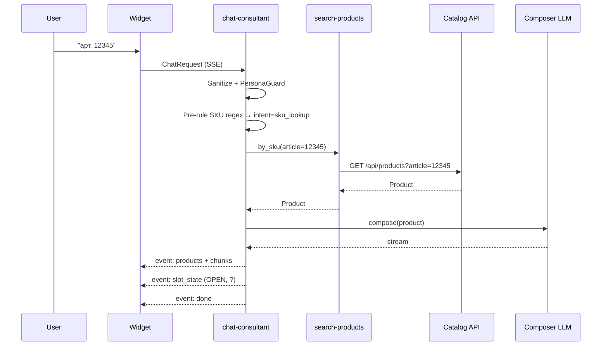
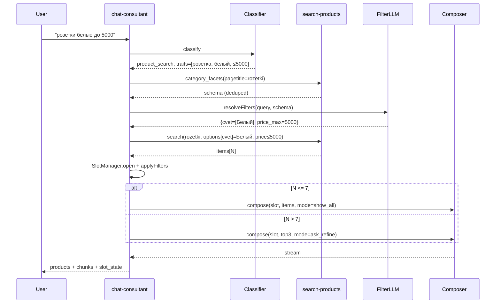
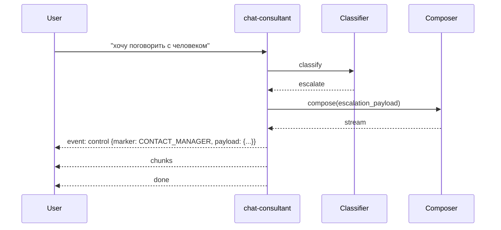
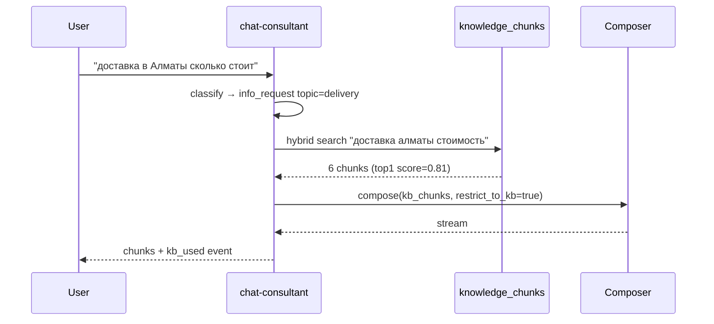

# Чат-консультант 220volt — Спецификация системы (v2.0)

> **Документ:** Production-grade Technical Specification
> **Статус:** Утверждено к реализации
> **Аудитория:** Архитекторы, backend/frontend разработчики, QA, DevOps, дежурные инженеры
> **Принцип:** Самодостаточный документ. Описывает целевую систему. Не содержит отсылок к предыдущим версиям.

---

## Оглавление

1. [Назначение и границы системы](#1-назначение-и-границы-системы)
2. [Глоссарий](#2-глоссарий)
3. [Архитектура](#3-архитектура)
4. [Доменная модель и инварианты](#4-доменная-модель-и-инварианты)
5. [State Machine диалога](#5-state-machine-диалога)
6. [Конвейер обработки реплики (Turn Pipeline)](#6-конвейер-обработки-реплики-turn-pipeline)
7. [Модуль: Intent Classifier](#7-модуль-intent-classifier)
8. [Модуль: Slot Manager](#8-модуль-slot-manager)
9. [Модуль: Catalog Search](#9-модуль-catalog-search)
9A. [Контракты Catalog API (220volt)](#9a-контракты-catalog-api-220volt)
10. [Модуль: Knowledge Base RAG](#10-модуль-knowledge-base-rag)
11. [Модуль: Response Composer](#11-модуль-response-composer)
11A. [Модуль: Progressive Feedback (Thinking Phrases)](#11a-модуль-progressive-feedback-thinking-phrases)
12. [Модуль: Persona Guard](#12-модуль-persona-guard)
13. [Контракты данных (TypeScript)](#13-контракты-данных-typescript)
14. [Схема БД (DDL)](#14-схема-бд-ddl)
15. [API контракты (Edge Functions)](#15-api-контракты-edge-functions)
16. [Sequence-диаграммы ключевых сценариев](#16-sequence-диаграммы-ключевых-сценариев)
17. [Конверсационные правила](#17-конверсационные-правила)
18. [Правила эскалации](#18-правила-эскалации)
19. [Кэширование](#19-кэширование)
20. [SLA / SLO / SLI](#20-sla--slo--sli)
21. [Error Matrix и Retry политики](#21-error-matrix-и-retry-политики)
22. [Observability](#22-observability)
23. [Безопасность](#23-безопасность)
24. [Конфигурация](#24-конфигурация)
25. [Golden Test Suite (64 кейса)](#25-golden-test-suite-60-кейсов)
26. [Критерии успешности](#26-критерии-успешности)
27. [Runbook для дежурного](#27-runbook-для-дежурного)
28. [Открытые вопросы](#28-открытые-вопросы)

---

## 1. Назначение и границы системы

### 1.1 Назначение

Чат-консультант — диалоговый агент интернет-магазина 220volt.kz. Помогает посетителю:
- найти товар по артикулу, названию, характеристикам или сценарию использования;
- сравнить альтернативы, получить замены отсутствующего товара;
- получить справочную информацию (доставка, оплата, гарантия, акции);
- эскалировать запрос живому менеджеру, когда задача выходит за рамки автоматики.

### 1.2 Бизнес-цели

| Цель | Метрика | Целевое значение |
|---|---|---|
| Снизить нагрузку на менеджеров | % запросов, закрытых ботом | ≥ 70 % |
| Увеличить конверсию посетитель → корзина | Показ карточек / сессия | ≥ 1.5 |
| Удержать пользователя в диалоге | Средняя длина сессии | ≥ 4 turn |
| Корректность товарных рекомендаций | Точность top-3 (выборка) | ≥ 90 % |

### 1.3 В скоупе

- Веб-виджет, встраиваемый через `embed.js` на любой странице сайта.
- Серверная логика обработки реплик (Edge Function на Supabase).
- Интеграция с публичным каталогом 220volt через REST API (источник правды).
- База знаний (статьи, инструкции, акции) в Postgres + pgvector.
- Логирование использования и стоимости LLM.

### 1.4 Вне скоупа

- Локальная синхронизация каталога в БД (запрещено политикой проекта).
- Оформление заказов внутри чата (передача в корзину сайта только ссылками).
- Голосовой ввод и видеозвонки.
- Многоязычность сверх русского/казахского (UI на русском).

---

## 2. Глоссарий

| Термин | Определение |
|---|---|
| **Turn** | Один полный цикл: реплика пользователя → ответ ассистента. |
| **Session** | Серия turns в рамках одного `session_id`, хранится клиентом в `sessionStorage`. |
| **Intent** | Тип намерения пользователя в текущей реплике (см. §7). |
| **Slot** | Активное состояние поиска: категория + применённые фильтры + диапазон цен + сортировка. |
| **Slot Lifecycle** | OPEN → REFINING → CLOSED. CLOSED = слот удалён (новая категория, явный сброс, или >7 результатов после уточнения). |
| **Probe** | Проверочный API-запрос в каталог для оценки осуществимости фильтра (count, sample). |
| **Bucket** | Группа товаров одной категории внутри multi-vector поиска. |
| **Domain Guard** | Защита от выдачи товаров не той физической предметной области (см. §9.5). |
| **CONTACT_MANAGER** | Управляющий маркер ответа, триггерящий рендер карточки эскалации. |
| **Lexicon** | Внешний словарь бытовых / переводных / сленговых синонимов (`app_settings.lexicon_json`), in-memory кэш в edge. Используется до Facet Matcher для канонизации трейтов. См. §9.2b. |
| **Canonical Token** | Токен, реально присутствующий в `name`/`артикуле` товара (например, `CORN`, `IP65`, `A60`). Только такие токены допустимо инжектить в `?query=` каталога, и только из Lexicon с `confidence ≥ 0.9` и `type=name_modifier`. |
| **Trait Expansion** | Дополнение исходных пользовательских трейтов значениями из Lexicon, которые соответствуют значениям характеристик категории (например, «груша» → `A60`). Передаётся в Facet Matcher вместе с исходными трейтами. |
| **Soft Fallback** | Стратегия Composer'а: если в текущем turn есть и `resolved` ≥ 2 фильтра, и `unresolved`/`pending_clarification` — выполнить strict search по `resolved`, показать товары и **дополнить** ответ пояснением о том, что не нашли. См. §11.2a. |

---

## 3. Архитектура

### 3.1 Топология

```
┌─────────────┐      HTTPS/SSE     ┌─────────────────────┐
│   Browser   │ ◄──────────────── ►│  Edge Function:     │
│  embed.js   │                    │  chat-consultant    │
│  React UI   │                    │  (Supabase Deno)    │
└─────────────┘                    └──────────┬──────────┘
                                              │
                ┌─────────────────────────────┼──────────────────────────┐
                │                             │                          │
                ▼                             ▼                          ▼
   ┌────────────────────┐       ┌─────────────────────┐      ┌──────────────────────┐
   │  OpenRouter API    │       │  Catalog REST API   │      │  Supabase Postgres   │
   │  (Gemini models):  │       │  220volt.kz         │      │  - knowledge_*       │
   │  classifier,       │       │  /api/products      │      │  - app_settings      │
   │  composer,         │       │  /api/categories    │      │  - chat_cache_v2     │
   │  embeddings        │       │  /api/options       │      │  - ai_usage_logs     │
   └────────────────────┘       └─────────────────────┘      └──────────────────────┘
```

### 3.2 Принципы

1. **Stateless edge.** Edge Function не хранит in-memory состояние между turns; всё необходимое приходит в payload или подгружается из БД/cache.
2. **Источник правды — каталог.** Никаких локальных копий товаров. Все цены, остатки, опции — реал-тайм из API.
2.1. **Lexicon Cache** — единственное исключение по «нелокальности»: in-memory словарь бытовых синонимов из `app_settings.lexicon_json` (hot-reload каждые 60 секунд). Каталог товаров не кэшируется, словарь синонимов кэшируется (он редко меняется и read-heavy).
3. **Детерминированный поток.** Управляющая логика — конечный автомат. LLM используется только для (a) классификации, (b) выбора фильтров из закрытого списка, (c) генерации финальной формулировки.
4. **LLM не имеет полномочий действия.** LLM не вызывает инструменты сама. Все вызовы каталога инициирует FSM по факту классифицированного intent.
5. **Кэшируем то, что дорого и стабильно.** Категории, опции, нормализованные intent короткоживущих фраз — да. Финальные ответы — нет.
6. **Оркестратор виден.** Каждый turn пишет полную трассу в `chat_traces` (если включено) с ID шагов для отладки.

### 3.3 Технологический стек

| Слой | Технология |
|---|---|
| UI виджет | React 18, Vite 5, Tailwind v3, TypeScript 5 |
| Embed loader | Vanilla JS (`public/embed.js`) |
| Edge Runtime | Deno (Supabase Edge Functions) |
| БД | PostgreSQL 15 + pgvector |
| Поиск БЗ | tsvector (BM25-подобный) + cosine similarity |
| LLM Gateway | OpenRouter (модели: Gemini 2.5 Flash / Flash Lite) |
| Транспорт | Server-Sent Events (SSE) |
| CDN/Прокси | Cloudflare Workers (30 s timeout на subrequest) |
| Хранение состояния клиента | `sessionStorage` ключ `volt_widget_state` |

### 3.4 Сетевые границы

- Браузер ↔ Edge: HTTPS, токен `apikey` (anon Supabase key).
- Edge ↔ OpenRouter: HTTPS, секрет `OPENROUTER_API_KEY` (из `app_settings`).
- Edge ↔ Catalog: HTTPS, токен `volt220_api_token` в заголовке.
- Edge ↔ Postgres: внутренний пул соединений Supabase.

---

## 4. Доменная модель и инварианты

### 4.1 Сущности

```
Session (1) ──< (N) Turn ──< (N) TraceStep
Session (1) ──── (0..1) Slot
Slot     (1) ──< (N) AppliedFilter
```

### 4.2 Слот (Slot)

Активный контекст поиска внутри сессии.

```
Slot {
  id: string                       // UUID, генерируется на сервере
  session_id: string
  category: { id: string; pagetitle: string; title: string }
  applied_filters: AppliedFilter[]
  price_range?: { min?: number; max?: number }
  sort?: 'price_asc' | 'price_desc' | 'relevance'
  created_at: ISO8601
  last_refined_at: ISO8601
  result_count?: number            // последний известный count
}
AppliedFilter {
  key: string                      // канонический ключ опции (после dedupe)
  values: string[]                 // OR внутри ключа
  source: 'user' | 'llm'
}
```

### 4.3 Инварианты слота

- **И1.** В сессии существует не более одного активного слота.
- **И2.** Слот привязан ровно к одной категории (`category.id`).
- **И3.** При смене категории старый слот закрывается (CLOSED), создаётся новый.
- **И4.** Каждый `applied_filter.key` встречается в `applied_filters` максимум один раз.
- **И5.** Каждый `value` принадлежит легальному списку значений категории на момент применения (валидация против `category_options_schema`).
- **И6.** При `result_count > 7` после уточнения — слот переходит в REFINING с подсказкой; при `result_count ≤ 7` остаётся OPEN.
- **И7.** Слот живёт максимум 30 минут с `last_refined_at`. По истечении — CLOSED.

### 4.4 Реплика (Turn)

```
Turn {
  id: string
  session_id: string
  index: number                    // 0-based порядковый номер
  user_text: string                // макс 2000 символов
  intent: Intent                   // см. §7
  slot_snapshot_before?: Slot
  slot_snapshot_after?: Slot
  retrieved_products?: Product[]
  retrieved_kb_chunks?: KbChunk[]
  assistant_text: string
  control_markers: ControlMarker[] // напр. CONTACT_MANAGER
  latency_ms: number
  cost_usd: number
  created_at: ISO8601
}
```

### 4.5 Запрещённые состояния

- ❌ Слот без категории.
- ❌ Слот с категорией, у которой `confidence < 0.4` (такой слот не создаётся — идёт §9.4 multi-bucket fallback).
- ❌ Слот с фильтром, ключ которого отсутствует в схеме категории.
- ❌ `pending_clarification` непустое и одновременно выполнен поиск товаров в этом turn — **за исключением Soft Fallback (§11.2a): если `resolved.length ≥ 2`, поиск выполняется по resolved-фильтрам и товары показываются**, а уточнение становится non-blocking (доп. строкой в ответе).
- ❌ Состояние `AWAITING_CLARIFICATION` без заполненного `pending_clarification`.
- ❌ `pending_clarification` сохранилось при смене темы пользователем (intent=`small_talk` / `info_request` / `sku_lookup` / `product_search` с другой категорией) — должно быть **немедленно очищено** Slot Manager'ом.
- ❌ В URL Catalog API параметр `?query=` содержит токены, не входящие в `Lexicon.canonical_tokens` (type=`name_modifier`, confidence ≥ 0.9) текущего turn'а. Любое исключение — defect категории `query_pollution`.
- ❌ Turn без `intent`.
- ❌ Ответ ассистента, содержащий приветствие (см. §17).
- ❌ Ответ с товаром в формате, отличном от канонического markdown (см. §17).
- ❌ Ответ ассистента, содержащий ссылку на товар, чей `id` отсутствует в `event: products` этого turn'а — клиент обязан скрыть такую ссылку (§17.3).

---

## 5. State Machine диалога

### 5.1 Состояния сессии

| Состояние | Описание |
|---|---|
| `IDLE` | Сессия открыта, активного слота нет. |
| `SLOT_OPEN` | Активный слот существует, последний поиск дал ≤ 7 результатов. |
| `SLOT_REFINING` | Слот существует, требуется уточнение (>7 результатов). |
| `SLOT_AWAITING_CLARIFICATION` | Facet Matcher (§9.3) вернул `unresolved` с известным `nearest_facet_key` и `available_values`. Поиск НЕ выполнен; ассистент задал уточняющий вопрос со списком значений. Ожидается ответ пользователя. |
| `ESCALATED` | Последний turn содержал `[CONTACT_MANAGER]`. Сессия продолжается, но дальнейшие реплики снова идут через классификатор. |
| `EXPIRED` | TTL слота истёк, переходит к `IDLE` при следующем turn. |

### 5.2 Таблица переходов

| Из | Событие | В | Действие |
|---|---|---|---|
| `IDLE` | intent=`product_search` | `SLOT_OPEN`/`SLOT_REFINING`/`SLOT_AWAITING_CLARIFICATION` | создать слот, выполнить §9.2a→§9.3→поиск |
| `IDLE` | intent=`sku_lookup` | `SLOT_OPEN` | прямой запрос по артикулу |
| `IDLE` | intent=`info_request` | `IDLE` | RAG по БЗ |
| `IDLE` | intent=`small_talk` | `IDLE` | вежливый редирект к сути |
| `IDLE` | intent=`escalate` | `ESCALATED` | вернуть карточку контактов |
| `SLOT_OPEN` | intent=`refine_filter` | `SLOT_OPEN`/`SLOT_REFINING`/`SLOT_AWAITING_CLARIFICATION` | дополнить слот, повторить §9.3+поиск |
| `SLOT_OPEN` | intent=`product_search` (новая категория, Resolver conf ≥ 0.7) | переход в новый `SLOT_OPEN` | закрыть старый слот |
| `SLOT_OPEN` | intent=`reset_slot` | `IDLE` | удалить слот |
| `SLOT_OPEN` | intent=`info_request` | `SLOT_OPEN` | RAG, слот сохранить |
| `SLOT_OPEN`/`SLOT_REFINING` | intent=`next_page` | то же состояние | `slot.page_number += delta` (≥1), повторить strict search с тем же категорией/фильтрами и новой страницей |
| `SLOT_REFINING` | intent=`refine_filter` | `SLOT_OPEN`/`SLOT_REFINING`/`SLOT_AWAITING_CLARIFICATION` | применить, пересчитать |
| `SLOT_AWAITING_CLARIFICATION` | пользователь указал значение из `available_values` | `SLOT_OPEN`/`SLOT_REFINING` | реклассифицировать как `refine_filter`, повторить §9.3 с новым трейтом, очистить `pending_clarification` |
| `SLOT_AWAITING_CLARIFICATION` | пользователь сменил тему (intent=`product_search` с другой категорией ИЛИ `sku_lookup`) | соответствующее новое состояние | очистить `pending_clarification`, обработать как обычный turn |
| `SLOT_AWAITING_CLARIFICATION` | пользователь явно отказался уточнять («покажи всё», `intent=refine_filter` с пустым трейтом по этому facet) | `SLOT_OPEN`/`SLOT_REFINING` | очистить `pending_clarification`, выполнить поиск без этого фильтра, записать трейт в `slot.unresolved_traits` |
| любое | TTL > 30 мин | `EXPIRED` → `IDLE` | удалить слот |

### 5.3 Хранение состояния

- **Клиент:** `sessionStorage.volt_widget_state` хранит `{ session_id, history: Turn[], slot: Slot | null }`. Полный контекст уходит на сервер с каждым запросом.
- **Сервер:** stateless. Кэш `chat_cache_v2` (см. §19) — ускорение, не источник правды.

---

## 6. Конвейер обработки реплики (Turn Pipeline)

### 6.1 Этапы

```
[1] Receive Request
       │
       ▼
[2] Validate & Sanitize  ──── reject if violates limits
       │
       ▼
[3] Persona Guard (input)  ── strip greetings, profanity tags
       │
       ▼
[4] Intent Classifier (Micro-LLM)  ── output: Intent + entities
       │
       ▼
[5] FSM Transition Decision  ── select branch
       │
       ├──► [6a] Catalog Branch
       │      ├─ [6a.1] Category Resolver   ── LLM(query, slot, listCategories) → {pagetitle, confidence}
       │      ├─ [6a.2] Facet Schema Loader ── category_facets(pagetitle) → OptionSchema (cache 1ч)
       │      ├─ [6a.2.5] Lexicon Resolve   ── lexicon × user_traits → {expanded_traits, canonical_tokens, applied_aliases}  (in-memory, ≤3ms; см. §9.2b)
       │      ├─ [6a.3] Facet Matcher (LLM) ── expanded_traits × schema → {resolved, soft_matches, unresolved}
       │      ├─ [6a.4] Strict API Search   ── GET /api/products?category=…&query={canonical_tokens}&options[k][]=v…
       │      └─ [6a.5] Multi-bucket Fallback (см. §9.4) — только если confidence<0.4 ИЛИ resolved=∅
       ├──► [6b] KB Branch       ── hybrid retrieval
       ├──► [6c] Escalation      ── compose contact card
       └──► [6d] Small Talk      ── short redirect
       │
       ▼
[7] Response Composer (LLM)  ── render with strict markdown
       │
       ▼
[8] Persona Guard (output)  ── enforce no-greeting, format
       │
       ▼
[9] SSE Stream → Client
       │
       ▼
[10] Persist Trace + Usage
```

### 6.2 Бюджет латентности (p50)

| Этап | Бюджет, мс |
|---|---|
| 1 + 2 + 3 | 50 |
| 4 (Classifier, Flash Lite) | 350 |
| 5 | 5 |
| 6a — SKU lookup (1 API call) | 600 |
| 6a.1 Category Resolver (Flash Lite) | 400 |
| 6a.2 Facet Schema Loader (cache hit) | 30 |
| 6a.2.5 Lexicon Resolve (in-memory) | 3 |
| 6a.3 Facet Matcher (Flash) | 600 |
| 6a.4 Strict API Search | 1 500 |
| 6b — KB hybrid retrieval | 700 |
| 7 (Composer, Flash) | 1 500 |
| 8 + 9 (first byte) | 100 |
| **Итого SKU lookup** | **≤ 2 600** |
| **Итого фильтрованный поиск (single-category)** | **≤ 5 800** |
| **Итого фильтрованный поиск (с multi-bucket fallback)** | **≤ 7 200** |

### 6.3 Параллелизация

- Этап **6a** при сложных запросах распараллеливает probes по фильтрам (`Promise.allSettled` с лимитом 5).
- Этап **6b** запускается параллельно с **6a**, если intent гибридный (`mixed`); результаты объединяются перед композером.

---

## 7. Модуль: Intent Classifier

### 7.1 Назначение

Преобразовать одну реплику + краткий контекст слота в типизированное намерение. **Только текущая реплика** анализируется на предметные сущности; история используется лишь для разрешения местоимений и подтверждений.

### 7.2 Список intents

| Intent | Триггер | Поля entities |
|---|---|---|
| `sku_lookup` | Распознан артикул (regex `^\s*[A-ZА-Я0-9\-]{4,}\s*$` или явный «артикул …»). | `sku: string` |
| `product_search` | Запрос товара по названию/категории/сценарию. | `category_hint?: string`, `query: string`, `traits: string[]` |
| `refine_filter` | Уточнение к активному слоту (цвет, бренд, мощность, цена). | `filters: {key: string; values: string[]}[]`, `price?: {min?:number;max?:number}`, `sort?` |
| `info_request` | Вопрос про доставку, оплату, гарантию, адреса, акции, инструкции. | `topic: string` |
| `is_replacement` | Пользователь просит замену/аналог. | `original_sku_or_name: string`, `traits: string[]` |
| `escalate` | Прямой запрос менеджера, жалоба, нестандартный кейс. | `reason: string` |
| `reset_slot` | Явный сброс («начни заново», «другой товар»). | — |
| `next_page` | «покажи ещё», «дальше», «следующие», «more» — пагинация по текущему слоту. | `delta?: number` (по умолчанию 1, может быть отрицательным для «назад») |
| `small_talk` | Не относится к делу (приветствие, благодарность, шутка). | — |
| `unknown` | Классификатор не уверен. Fallback в `info_request`. | — |

### 7.3 Контракт

```ts
interface ClassifierInput {
  text: string;                    // raw user message
  active_slot?: {
    category_pagetitle: string;
    applied_filter_keys: string[];
    pending_clarification?: { facet_caption: string; available_values: string[] }; // §13.1
  };
  recent_assistant_summary?: string; // ≤ 200 символов
}

interface ClassifierOutput {
  intent: Intent;
  confidence: number;              // 0..1
  entities: Record<string, unknown>;
  raw_llm_json?: string;           // для логов
}
```

### 7.4 Алгоритм

1. **Pre-rules (детерминированные):**
   - Если `text` матчит regex артикула → `sku_lookup` без LLM.
   - Если `text.length < 3` → `small_talk`.
   - Если `text` содержит явные триггеры эскалации (см. §18) → `escalate` без LLM.
2. **LLM-классификация:** модель `gemini-2.5-flash-lite`, `temperature=0`, JSON mode, system prompt с примерами на русском и казахском.
3. **Post-validation:** если intent ∈ {`refine_filter`} но `active_slot` отсутствует → реклассифицировать как `product_search`.
4. **Кэш:** ключ `sha256(normalized_text + active_slot?.category_pagetitle)`. TTL 24 ч. Хранение: `chat_cache_v2`, namespace `intent`.

### 7.5 Качество

- Точность classifier на golden set ≥ 95 %.
- При `confidence < 0.6` — путь `unknown` → информационный fallback с подсказкой переформулировать.

---

## 8. Модуль: Slot Manager

### 8.1 Ответственность

- Создание / обновление / закрытие слота.
- Валидация `applied_filters` против схемы категории.
- Принятие решения о переходе `OPEN ↔ REFINING`.

### 8.2 Операции

```ts
interface SlotManager {
  open(session_id: string, category: Category): Slot;
  applyFilters(slot: Slot, filters: AppliedFilter[]): Slot;
  applyPrice(slot: Slot, range: PriceRange): Slot;
  close(slot: Slot, reason: 'user_reset' | 'category_change' | 'ttl' | 'auto_release'): void;
  attachResultCount(slot: Slot, count: number): Slot;  // обновляет состояние OPEN/REFINING
}
```

### 8.3 Правила слияния фильтров

- Если новый фильтр имеет ключ, уже присутствующий в слоте:
  - значения **дополняют** (union) текущие, если intent явно «или ещё …»;
  - **заменяют** значения, если фраза имеет уточняющий характер («только белые»).
- Цена всегда **заменяет** предыдущую (нет смысла в OR-диапазонах).
- Несовместимые фильтры (например, `voltazh="220 В"` и `voltazh="380 В"` без союза «или») приводят к запросу уточнения у пользователя — слот не модифицируется.

### 8.4 Auto-release

Слот автоматически закрывается, если:
- `result_count` после refine = 0 и Soft Fallback вернул альтернативы из другой категории;
- intent классифицирован как `product_search` с другой категорией;
- TTL 30 минут истёк.

---

## 9. Модуль: Catalog Search

### 9.1 Источник данных

REST API 220volt.kz (OpenAPI 3.0). Полный контракт зафиксирован в репозитории: `docs/external/220volt-swagger.json` (snapshot эталона). Базовый URL: `https://220volt.kz`.

Используемые эндпоинты (реальные, проверены curl-аудитом):

| Эндпоинт | Назначение | Ключевой параметр |
|---|---|---|
| `GET /api/products?query=...&page=...&per_page=...` | Полнотекстовый поиск товаров | `query` (string) |
| `GET /api/products?article={sku}` | **Поиск по артикулу** (отдельного `/products/{sku}` НЕТ) | `article` (string) |
| `GET /api/products?category={pagetitle}&...` | Фильтр по категории | `category` = **pagetitle** (string), не id |
| `GET /api/products?options[{key}][]={value}&...` | Фасетный фильтр | `options[brend__brend][]=Schneider` |
| `GET /api/products?min_price=...&max_price=...` | Ценовой фильтр | целые ₸ |
| `GET /api/categories?parent=0&depth=10&per_page=200&page=N` | Дерево категорий (постранично) | возвращает `pagetitle`, `id` (number) |
| `GET /api/categories/{id}/options` | Схема опций категории по числовому id | возвращает `{ category, options[] }` |
| `GET /api/categories/options?pagetitle=...` | То же по pagetitle | альтернативный путь |

**Аутентификация:** `Authorization: Bearer <volt220_api_token>` для всех запросов. Токен хранится в `app_settings.volt220_api_token` (RLS — только service-role/admin). Хотя swagger не описывает security-схему явно, продакшен-инстанс возвращает 401 без токена.

**Ограничения и нюансы:**
- `per_page` максимум 200 (категории), для `/products` — рекомендуем ≤ 50.
- Категория фильтруется **только по `pagetitle`** (string-slug). Числовой id передавать в `?category=` нельзя.
- Все `id` (категорий, товаров) — `integer`, не `string`.
- Ответы списков обёрнуты: `{ success: true, data: { results: [...], pagination: {...} } }`.
- Карточные ответы: `{ success: true, data: { ... } }` (для `/categories/{id}/options` встречается двойная вложенность — см. §9A.3).

Все вызовы проксируются через edge function `search-products` (централизованный кэш фасетов и категорий, единая точка обработки auth/ошибок).

### 9.2 Стратегии поиска

| Стратегия | Когда применяется | Шаги |
|---|---|---|
| **Direct SKU** | intent = `sku_lookup` | `GET /api/products?article={sku}` → `data.results[0]` (если пусто → soft 404) |
| **Single-category strict** *(дефолтный путь)* | intent ∈ {`product_search`, `refine_filter`} И Category Resolver вернул confidence ≥ 0.4 | (1) §9.2a Category Resolver → (2) `GET /api/categories/options?pagetitle=…` → (3) §9.3 Facet Matcher → (4) `GET /api/products?category={pagetitle}&options[k][]=v…&min_price&max_price` |
| **Multi-bucket Fallback** | Category Resolver confidence < 0.4 ИЛИ Facet Matcher вернул resolved=∅ для категориального трейта ИЛИ гибридный запрос | См. §9.4. Не дефолтный путь — страховка. |
| **Replacement** | intent = `is_replacement` | (1) карточка оригинала: `GET /api/products?article={sku}` → (2) выделение трейтов из `category.pagetitle` + ключевых `options[]` → (3) Single-category strict в той же категории, исключая исходный article → (4) LLM-сравнение |

### 9.2a Category Resolver

Первоклассный этап pipeline (см. §6.1, шаг 6a.1). Цель — однозначно определить категорию каталога ДО загрузки facets и запроса товаров. Это устраняет «угадывание» категории по выдаче `?query=` и обеспечивает, что matching трейтов идёт по правильной схеме характеристик.

```ts
function resolveCategory(input: {
  user_query: string;                  // нормализованный текст реплики
  user_traits: string[];               // из Intent Classifier
  active_slot?: Slot;
  categories_flat: string[];           // listCategories(), кэш 1 ч
}): Promise<{
  pagetitle: string | null;            // null только при confidence < 0.4
  confidence: number;                  // 0..1
  reasoning: string;                   // краткое для трейса
  alternatives: { pagetitle: string; confidence: number }[]; // топ-3 для трейса
}>;
```

**Правила выбора ветки:**

| Confidence | Ветка | Поведение Composer |
|---|---|---|
| `≥ 0.7` | Single-category strict | Молча использует категорию |
| `0.4 ≤ c < 0.7` | Single-category strict + флаг `category_uncertain=true` | Добавляет в ответ: «Ищу в категории *X*. Если имели в виду другое — уточните». |
| `< 0.4` | Multi-bucket Fallback (§9.4) | Категория «всплывает» из выдачи |

**Короткие пути (Resolver пропускается):**
- `intent = sku_lookup` — категория не нужна;
- `intent = refine_filter` И `active_slot.category.pagetitle` существует И не пустой → используется `active_slot.category` (пользователь уточняет в той же категории);
- `intent = product_search`, но `user_query` содержит явное имя категории, точно совпадающее с одним из `categories_flat` (case-insensitive, после lemma-нормализации) → confidence=1.0 без LLM.

**Контракт промпта:**
- Модель: Flash Lite (бюджет 400 мс p50).
- Вход: `user_query`, `user_traits`, `categories_flat` (≈600 элементов; передаётся как нумерованный список).
- Выход: строго JSON `{pagetitle, confidence, reasoning, alternatives}`. Никакого свободного текста.
- Запрет: возвращать pagetitle, отсутствующий в переданном списке. При нарушении — реклассификация в multi-bucket с логированием `category_resolver_hallucination`.

### 9.2b Lexicon Resolver

Промежуточный детерминированный шаг между Category Resolver (§9.2a) и Facet Matcher (§9.3). Цель — канонизировать бытовые / переводные / сленговые / опечаточные термины пользователя ДО фасетного матчинга, **без LLM-вызова на лету**, in-memory, ≤3 мс.

**Зачем нужен.** Каталог 220volt — реальный e-commerce, в котором бытовые названия товаров живут только в `name`/`артикуле` и не отражены в характеристиках. Канонический пример: «лампа кукуруза» (народный термин) → товар «Лампа LED **CORN** капсула 3,5Вт … G4 ИЭК», у которого:

- слово `CORN` есть только в `name` и в `article`;
- слова `кукуруза` нет нигде;
- характеристика «Форма колбы» = `капсула` (не «corn», не «кукуруза»).

Без Lexicon Resolver такие запросы либо ушли бы в multi-bucket fallback (Domain Guard может среагировать на «попкорн»), либо отдали бы пользователю случайные лампы из категории. Lexicon Resolver решает это детерминированным маппингом.

#### Контракт

```ts
interface LexiconInput {
  user_traits: string[];               // из Intent Classifier (entities.traits)
  user_query_raw: string;              // полный текст реплики (для regex-матчинга)
  resolved_category: { pagetitle: string };  // из §9.2a
}

interface LexiconOutput {
  expanded_traits: string[];           // user_traits ∪ ⋃(matched.trait_expansion); дедуплицировано
  canonical_tokens: string[];          // токены для ?query= (из matched, type='name_modifier', confidence ≥ 0.9)
  applied_aliases: AppliedAlias[];     // для логов, метрик, soft_matches Composer'а
}

interface AppliedAlias {
  user_term: string;                   // что увидели в реплике, например "кукуруза"
  matched_pattern: string;             // regex из lexicon_json
  canonical_token?: string;            // например "CORN" (если есть)
  trait_expansion: string[];           // например ["капсула"]
  source: 'lexicon';                   // зарезервировано для будущих источников
  confidence: number;                  // из записи lexicon
}
```

#### Источник словаря — `app_settings.lexicon_json`

Структура (full schema):

```json
{
  "version": 1,
  "entries": [
    {
      "id": "corn-lamp",
      "match": ["кукуруз\\w*", "\\bcorn\\b"],
      "canonical_token": "CORN",
      "trait_expansion": ["капсула"],
      "domain_categories": ["lampyi"],
      "type": "name_modifier",
      "confidence": 1.0,
      "comment": "лампа кукуруза → CORN (в name) + капсула (в форме колбы)"
    },
    {
      "id": "pear-bulb",
      "match": ["груш\\w*"],
      "trait_expansion": ["A60"],
      "domain_categories": ["lampyi"],
      "type": "facet_alias",
      "confidence": 1.0
    },
    {
      "id": "minion-socle",
      "match": ["миньон\\w*"],
      "trait_expansion": ["E14"],
      "domain_categories": ["lampyi"],
      "type": "facet_alias",
      "confidence": 1.0
    }
  ]
}
```

Поля записи:

| Поле | Тип | Описание |
|---|---|---|
| `id` | string | Стабильный человекочитаемый идентификатор для логов и аналитики |
| `match` | `string[]` | Массив RegEx-паттернов, применяются к каждому трейту И к `user_query_raw`. Морфология учитывается через `\\w*` |
| `canonical_token` | `string \| null` | Токен, реально живущий в `name`/`артикуле` товара. `null` — синоним отображается только в характеристики, в `?query=` не идёт |
| `trait_expansion` | `string[]` | Дополнительные значения для Facet Matcher (мапятся на значения характеристик категории) |
| `domain_categories` | `string[]` | Список `pagetitle` категорий, в которых синоним применим. **Пустой массив — универсально (все категории)**. Защита от ложных срабатываний за пределами домена |
| `type` | `'name_modifier' \| 'facet_alias' \| 'bilingual_pair'` | Тип записи. `name_modifier` — единственный тип, чьи `canonical_token` могут попасть в `?query=` |
| `confidence` | `number 0..1` | Используется при пороговой проверке `≥ 0.9` для допуска `canonical_token` в `?query=` |
| `comment` | `string?` | Свободное поле для документирования происхождения записи |

#### Алгоритм

```
1. Нормализация входа: 
   - normalize(t) = lowercase(NFKC(t)).replace(/ё/g, 'е').trim()
   - применить ко всем элементам user_traits и к user_query_raw
2. Для каждой entry в lexicon.entries:
   2.1. Если entry.domain_categories непустой И не содержит resolved_category.pagetitle 
        → пропустить entry (защита от ложных срабатываний).
   2.2. Для каждого pattern в entry.match:
        - regex = new RegExp(pattern, 'iu')
        - matched_in_traits = user_traits.filter(t => regex.test(normalize(t)))
        - matched_in_query = regex.test(normalize(user_query_raw))
        - если matched_in_traits.length > 0 ИЛИ matched_in_query → entry активирована
   2.3. Если активирована:
        - expanded_traits ∪= entry.trait_expansion
        - applied_aliases.push({ 
            user_term: matched_in_traits[0] ?? extracted_match_from_query,
            matched_pattern: pattern,
            canonical_token: entry.canonical_token,
            trait_expansion: entry.trait_expansion,
            source: 'lexicon',
            confidence: entry.confidence
          })
        - если entry.type === 'name_modifier' И entry.confidence ≥ 0.9 И entry.canonical_token:
            canonical_tokens.push(entry.canonical_token)
3. Дедуплицировать expanded_traits и canonical_tokens (case-insensitive для трейтов; точное для tokens).
4. expanded_traits ∪= user_traits  (исходные трейты сохраняются для Facet Matcher).
5. Вернуть { expanded_traits, canonical_tokens, applied_aliases }.
```

#### Использование результата

- **Facet Matcher (§9.3)** получает на вход `expanded_traits` (а не исходные `user_traits`).
- **Strict API Search (§9.2 Single-category strict)**:
  ```
  GET /api/products?category={pagetitle}
                    &query={canonical_tokens.join(' ')}     // только если canonical_tokens.length > 0
                    &options[k][]=v...
                    &min_price=...&max_price=...
  ```
  Если `canonical_tokens` пустой — параметр `query` **не передаётся вовсе**.
- **Composer (§11.2a)** получает `applied_aliases` для прозрачного объяснения пользователю: «Учёл, что *кукуруза* = CORN (форм-фактор)».

#### Bootstrap словаря (MVP)

- **Стартовое состояние:** `app_settings.lexicon_json = { version: 1, entries: [] }`. **Никаких seed-записей в коде, миграциях или дефолтах.** Lexicon — это онтологический слой бытовых названий, обнаруженных на реальных пользователях; до первого ревью провалов он пуст, и пайплайн обязан работать корректно (см. инвариант L5).
- **Continuous enrichment (с момента первых логов):** cron-задача раз в сутки агрегирует кейсы `applied_aliases=∅ AND (unresolved_traits.length > 0 OR result_count = 0)` из `chat_traces` с frequency ≥ 5; пропускает через batch-LLM (один большой prompt, не на лету) для генерации **кандидатов** entries; кладёт их в админку для модерации; admin/editor одобряет → запись попадает в `lexicon_json`. Никакой автоматической записи в production-словарь без human-in-the-loop.
- **Принцип:** словарь растёт строго на основании реальных провалов. «Заранее знать про CORN» — гипотеза; **факт** появляется только после того, как пользователь спросил «лампа кукуруза» и Lexicon Resolver вернул пустой `expanded_traits`.

#### Защита от ложных срабатываний

1. **Domain gating через `domain_categories`** — основной барьер. «Кукуруза» в категории `kuxnya` (если бы такая была) не активирует corn-entry, потому что `domain_categories=["lampyi"]`.
2. **Domain Guard (§9.5) после поиска** — второй барьер. Даже если бы entry активировалась ошибочно, итоговая выдача отфильтруется.
3. **Bootstrap-only seed** — на MVP запретить автоматическое добавление в словарь. Все entries проходят human review.
4. **Confidence ≥ 0.9** — единственный порог для допуска токена в `?query=`. Если синоним «вероятностный» (например, региональный сленг с риском омонимии) — confidence ставится 0.7–0.85, и `canonical_token` НЕ попадает в `?query=`, влияет только на `trait_expansion`.

#### Метрики (расширение §22.2)

| Метрика | Тип | Описание |
|---|---|---|
| `lexicon_aliases_applied_total{entry_id,category}` | counter | Сколько раз сработала каждая запись словаря |
| `lexicon_canonical_tokens_emitted_total{entry_id}` | counter | Сколько раз `canonical_token` ушёл в `?query=` |
| `lexicon_resolve_latency_ms` | histogram | Латентность шага 6a.2.5 |
| `lexicon_size_entries` | gauge | Количество записей в загруженном словаре |

#### Инварианты

- **L1.** `canonical_tokens` ⊆ `{entry.canonical_token | entry.type='name_modifier' ∧ entry.confidence ≥ 0.9}`. Никаких других источников у `canonical_tokens` нет.
- **L2.** Lexicon Resolver НЕ имеет права обращаться к LLM или внешним API. Только in-memory словарь.
- **L3.** `expanded_traits ⊇ user_traits` (исходные трейты никогда не теряются).
- **L4.** Lexicon Resolver пропускается, если `intent ∈ {sku_lookup, info_request, escalate, small_talk, reset_slot}` — для них нет Catalog Branch с фасетным поиском.
- **L5.** При `lexicon.entries = []` Resolver возвращает `{expanded_traits: user_traits, canonical_tokens: [], applied_aliases: []}` без ошибок. Пайплайн (Facet Matcher → Strict Search → Composer / Clarification) продолжает работать на исходных трейтах. Пустой словарь — валидное и корректное состояние системы.


Заменяет прежний «Resolve Filters». Работает **только** после Category Resolver выбрал категорию и Schema Loader загрузил её facets.

```ts
function matchFacetsWithLLM(input: {
  user_traits: string[];               // из Intent Classifier
  user_query_raw: string;              // исходник для лексического разбора
  schema: OptionSchema;                // полная схема facets выбранной категории
                                       // (после dedup и alias-collapse — см. §9B)
  active_filters: AppliedFilter[];     // ранее применённые в слоте
}): Promise<{
  resolved: AppliedFilter[];           // exact или lexical-equivalent matches
  soft_matches: SoftMatch[];           // confidence 0.6..0.85 — морфология/опечатки
  unresolved: UnresolvedTrait[];       // facet есть, но значения нет; либо facet не найден
  price?: PriceRange;
  sort?: Sort;
}>;

interface SoftMatch {
  key: string;                         // facet key
  suggested_value: string;             // значение из schema
  trait: string;                       // исходный пользовательский трейт
  confidence: number;                  // 0.6..0.85
  reason: 'morphology' | 'typo' | 'numeric_equivalent' | 'bilingual';
}

interface UnresolvedTrait {
  trait: string;
  nearest_facet_key?: string;          // если facet удалось определить, но value — нет
  available_values?: string[];         // топ-10 значений этого facet (для уточнения)
}
```

**Контракт промпта (системный, не патчевый):**

1. На вход подаётся ВСЯ схема facets выбранной категории (после dedup и alias-collapse §9B) + список user-traits + сырой `user_query_raw`.
2. Для каждого трейта LLM обязан выполнить шаги в порядке:
   1. **Найти подходящий facet-key** по семантике `caption_ru` (а не «что бы подошло»).
   2. **Найти точное значение** среди `values[]` этого facet, опираясь на следующие **принципы нормализации** (без жёстких таблиц соответствий — модель применяет их к данным, которые видит в `values[]`):
      - **Морфология RU и KK.** Привести трейт и значение к общей лемме (склонения, число, род, падеж). «двухгнёздная» / «двугнёздные» / «двухгнездные» — единая лемма.
      - **Орфографические варианты.** Нормализация `ё↔е`, дефис/слитно/раздельно, регистр, NFKC.
      - **Числовая нормализация.** Если `values[]` facet'а — числа (`["1","2","3","4"]`, `["6","10","16","25"]` и т. п.), а трейт выражает количество/номинал словесно («двойная», «спаренная», «на три места», «двух-», «трёх-», «II», «на шестнадцать ампер») — выбрать соответствующее число из `values[]`. Перечислений «двойная=2» в этой спецификации нет — нормализация выполняется LLM по типу значений конкретного facet'а.
      - **Билингвальность RU↔KK** на уровне `caption_ru` и значений (некоторые значения дублируются на двух языках или приходят только на одном).
      - **Составные конструкции.** «розетка с двумя гнёздами» — это трейт `«2»` для facet'а «Количество разъёмов»; разобрать конструкцию и отнести число к нужному facet'у.
   3. Классификация результата:
      - **resolved** — точное совпадение или лексический эквивалент с confidence ≥ 0.85;
      - **soft_matches** — морфологическая/опечаточная близость с 0.6 ≤ confidence < 0.85;
      - **unresolved (с `nearest_facet_key`)** — facet определён, но значение принципиально отсутствует (например, пользователь хочет «графитовый», а в палитре только чёрный/серый/белый);
      - **unresolved (без `nearest_facet_key`)** — facet не определён вовсе (трейт не отображается на схему категории).
3. **Запрещено** (без исключений):
   - Подмешивать любой нераспознанный трейт в `?query=` — нарушение контракта поиска. Если трейт нельзя замапить на facet — он идёт в `unresolved`, а Slot Manager инициирует уточнение (§5, состояние `SLOT_AWAITING_CLARIFICATION`).
   - Подмешивать в `?query=` значения **резолвленных** фасетов (никакого «query_fallback» для проблемных ключей — см. §9C.2 try-and-degrade).
   - Выбирать «ближайшее по смыслу» значение без явного указания confidence и reason.
   - Выдумывать значения, отсутствующие в `schema.values[]`.
   - Зашивать в промпт перечисления конкретных синонимов/числовых эквивалентов. Промпт описывает **принципы**, конкретные пары вычисляются LLM из `schema.values[]` категории.

**Поведение при unresolved:**

| Случай | Действие FSM | Действие Composer |
|---|---|---|
| `unresolved.length > 0`, есть `nearest_facet_key` и `available_values` | Создать `slot.pending_clarification`; перейти в `SLOT_AWAITING_CLARIFICATION`; **поиск НЕ выполняется** | Задать уточняющий вопрос со списком `available_values` |
| `unresolved.length > 0`, нет `nearest_facet_key` (трейт вне схемы) | Записать в `slot.unresolved_traits`; продолжить поиск с `resolved` фильтрами | Добавить строку «Не нашёл в характеристиках "{trait}" — показал по остальным критериям» |
| `soft_matches.length > 0` | Применить как фильтр; записать в `slot.soft_matches` | До списка товаров: «Точного "{trait}" нет, показал ближайшее: *{value}*» |

**Не зависит от поведения API на конкретных ключах.** Facet Matcher строит фильтры из схемы, как она есть. Если конкретный ключ API возвращает `total=0` (известная проблема некоторых non-ASCII ключей — см. §9C.2) — это решается **try-and-degrade на уровне Catalog Search по факту ответа**, а не предсказывается заранее на этапе матчинга. Алгоритм матчинга остаётся одинаковым для всех ключей.

### 9.4 Multi-bucket Fallback

**Не дефолтная стратегия.** Запускается только при условиях из §9.2a:
- `Category Resolver.confidence < 0.4`, ИЛИ
- На выбранной категории `Facet Matcher.resolved` пуст для основного категориального трейта (например, был выбран «Розетки», но ни «розетка», ни «штепсельный» не нашлись в названиях/значениях — индикатор неверного Resolver-выбора), ИЛИ
- Гибридный запрос с признаком `multi_category=true` от Intent Classifier (например, «розетки и удлинители для офиса»).

Алгоритм:
- Запускаются 2 параллельных API-запроса:
  - (a) `GET /api/products?category={pagetitle_hint}&query={user_query}` — `pagetitle_hint` берётся из топ-1 `alternatives` Category Resolver'а (если есть);
  - (b) `GET /api/products?query={user_query}` — без категориального фильтра.
- Результаты группируются по `result.category.pagetitle` (bucket key — pagetitle, **не id**).
- Бакеты с `count < 10` догружаются дополнительным запросом без фильтров (расширение).
- Каждый бакет проходит §9.3 Facet Matcher независимо (facets из `GET /api/categories/{id}/options`, `id` из `result.category.id`).
- Скоринг бакета: `score = relevance(0..100) − domainGuardPenalty(0..30) + bucketSizeBonus`.
- Победитель — бакет с максимальным score; пользователю показывается **из одной категории**. Категория-победитель записывается в Slot и при следующей реплике пользователя становится `active_slot.category` (Resolver пропускается — короткий путь).

### 9.5 Domain Guard

Защита от смешения предметных областей. Зарегистрированные «заразные» пары:

| Группа | Ключевые слова | Штраф к чужой группе |
|---|---|---|
| `power_socket` | розетка силовая, 220, 380, IP44 | -30 |
| `telecom` | RJ45, телефонная, USB, HDMI, антенная | -30 |
| `lighting_indoor` | светильник комнатный, бра, торшер | -20 |
| `lighting_outdoor` | прожектор, уличный, IP65 | -20 |

Реализация: keyword detection в названии бакета + категории; штраф вычитается при ранжировании.

### 9.6 Лимиты выдачи

- ≤ 7 товаров в бакете → показывать **все**.
- > 7 → показывать **топ-3** + общее количество + предложение уточнить (по конкретным ключам, у которых > 1 значение в выдаче).
- 0 товаров → **Soft Fallback**: показать ближайшие альтернативы (без скрытого отбрасывания пользовательских модификаторов; если что-то отбрасывается — явно предупредить).

### 9.7 Сортировка

- По умолчанию `relevance` (порядок API).
- `price_asc` / `price_desc` — **локальная сортировка** (см. §9C.1). Catalog API параметр `?sort=` **игнорирует** (подтверждено живым прогоном 28 апр 2026, дефект **B-API-003**). Алгоритм:
  1. `executeSearch` запрашивает `per_page=50` (макс. рекомендуемый), `?category=…` + резолвленные фильтры.
  2. Локально отбрасывает `price === 0` (см. §9C.3).
  3. Локально сортирует по цене и отдаёт топ-N (≤ 7, см. §9.6).
  4. Если оставшихся товаров < N — догружает `page=2,3…` до N или лимита 5 страниц.
  5. Composer добавляет sticky-warning: «Показываю самые дешёвые/дорогие из первых 50–250 товаров. Полный ассортимент в категории на сайте.»
- `?min_price=` / `?max_price=` работают и **предпочтительнее** локального сорта, когда пользователь назвал диапазон.
- Объёмная формула (для кабелей и т.п.): `Qty * Vol * 1.2` (кабели), `*1.1` (прочее). Формулу пользователю **не показывать**, только результат.

### 9.8 Замены и аналоги

```
1. Получить карточку оригинала: GET /api/products?article={sku} → data.results[0].
2. Извлечь трейты:
   - category.pagetitle (для повторного поиска в той же категории)
   - category.id (для подгрузки facets через /api/categories/{id}/options)
   - ключевые options[] (мощность, напряжение, сечение и т.п.) — берутся как { caption_ru, value_ru }.
3. searchProductsMulti(category=pagetitle, options[key][]=value, исключая article оригинала).
4. LLM-композер сравнивает кандидатов с оригиналом, выделяет 3-5 лучших.
5. В ответе указать, чем отличается каждая замена от оригинала.
```

---

## 9B. Facet Schema Dedup & Alias Collapse

Раздел упоминается в §9.3 (*«полная схема facets … после dedup и alias-collapse §9B»*) и описывает обязательную нормализацию `OptionSchema`, выполняемую Facet Schema Loader (шаг 6a.2) до её передачи в Facet Matcher (LLM). Цель — сократить токеновое потребление LLM, устранить шум и защититься от дрейфа схемы со стороны 220volt.

### 9B.1 Источник проблемы

Каталог 220volt исторически содержит:

- **Дубликаты ключей** с разным написанием: `brend__brend`, `Brand`, `Бренд` могут описывать один и тот же facet.
- **Дубликаты значений**: `Schneider`, `schneider`, `Schneider Electric`, `Шнайдер`.
- **Мусорные SEO-фасеты** с `count: 0` или `values.length > 200` (часто не релевантны для пользовательского выбора).
- **Двойной envelope** `body.data.data` для `/categories/{id}/options` (см. §9A.3) — handled separately.

Без нормализации Facet Matcher LLM получает схему на 30–50 % раздутую, что (а) повышает стоимость, (б) ухудшает качество матчинга (LLM путается между дубликатами).

### 9B.2 Алгоритм

Применяется к нормализованной `CategoryOptionsResponse.data.options[]` сразу после fetch, до записи в кэш `category_options`.

```
1. Канонизация ключа facet (key normalization):
   - lowercase
   - удалить дублирующие подстроки через `__` ("brend__brend" → "brend")
   - применить статичный alias-словарь (см. 9B.3): { "brand": "brend", "бренд": "brend", ... }
   - использовать каноничный key как идентификатор

2. Слияние дубликатов (key merge):
   - Для каждого канонического key: 
     - объединить все values[] из всех исходных facets с этим key (set-union по value_ru, case-insensitive)
     - выбрать caption_ru из первого исходного facet (или из alias_dict.preferred_caption, если задан)
     - суммировать count[] по совпадающим values
     - сохранить mapping original_keys[] → canonical_key для логов / алертов о drift'е API

3. Канонизация значений (value normalization):
   - normalize(v) = lowercase(NFKC(v.trim())).replace(/\s+/g, ' ')
   - применить value-alias словарь (см. 9B.3) для известных пар ("schneider electric" → "Schneider")
   - дедуплицировать values[] по нормализованной форме, сохраняя оригинальное value_ru первого вхождения

4. Фильтрация мусорных фасетов (drop rules):
   - drop, если values.length === 0
   - drop, если ВСЕ values[].count === 0 (если count предоставлен API)
   - drop, если values.length > MAX_VALUES_PER_FACET (default 200) — записать WARN в логи и метрику
     `facet_schema_oversize_total{key}`; не падать, только отбрасывать

5. Сортировка values[] по count DESC (если count есть), иначе по value_ru ASC.

6. Возврат нормализованной OptionSchema. Лог `facet_schema_dedup_stats { 
     category_pagetitle, 
     before: { facets, values_total }, 
     after:  { facets, values_total }, 
     dropped_facets: string[], 
     merged_keys: { canonical: string, sources: string[] }[]
   }`.
```

### 9B.3 Alias-словари (хранение)

```sql
-- Расширение app_settings: jsonb-поле facet_aliases_json
{
  "key_aliases": {
    "brand": "brend",
    "бренд": "brend",
    "brend__brend": "brend",
    "color": "cvet",
    "цвет": "cvet"
  },
  "value_aliases": {
    "brend": {
      "schneider electric": "Schneider",
      "шнайдер": "Schneider",
      "iek company": "IEK"
    }
  },
  "preferred_captions": {
    "brend": "Бренд",
    "cvet": "Цвет",
    "moshhnost": "Мощность, Вт"
  },
  "drop_facets": ["seo_keywords", "internal_tag"],
  "max_values_per_facet": 200
}
```

Hot-reload: edge читает `facet_aliases_json` тем же таймером, что и остальные `app_settings` (60 с).

### 9B.4 Контракт нормализованной схемы

Тип, отдаваемый Facet Schema Loader Facet Matcher'у:

```ts
interface NormalizedOptionSchema {
  category: { id: number; pagetitle: string; total_products?: number };
  options: Array<{
    key: string;                      // canonical
    caption_ru: string;
    caption_kz?: string;
    values: Array<{
      value_ru: string;               // оригинальное (для inject в options[k][]=v URL)
      value_kz?: string;
      count?: number;
    }>;
    _source_keys: string[];           // diagnostic: какие исходные keys были слиты
  }>;
  _stats: {                            // для логов и метрик, не для LLM
    facets_before: number;
    facets_after: number;
    values_before: number;
    values_after: number;
    dropped_facets: string[];
  };
}
```

Поля с префиксом `_` **исключаются** при сериализации схемы для prompt'а LLM (используются только для логов и трассировки).

### 9B.5 Метрики (расширение §22.2)

| Метрика | Тип | Описание |
|---|---|---|
| `facet_schema_dedup_compression_ratio{category}` | gauge | `values_after / values_before` — насколько ужалась схема |
| `facet_schema_dropped_facets_total{key}` | counter | Сколько раз каждый ключ был отброшен (мониторинг drift API) |
| `facet_schema_oversize_total{key}` | counter | Сколько раз facet был отброшен по `MAX_VALUES_PER_FACET` |
| `facet_schema_alias_merged_total{canonical}` | counter | Сколько раз alias-merge сработал (мониторинг drift API) |

### 9B.6 Инварианты

- **B1.** Канонический `key` в нормализованной схеме всегда соответствует тому, что 220volt API принимает в `?options[k][]=v` (то есть после alias-collapse мы используем уже каноническую форму ИЛИ мапим обратно при формировании URL — выбирается реализацией; trace должен фиксировать оба значения).
- **B2.** Никакая запись `value_ru` не теряется без логирования в `_stats.dropped_facets`.
- **B3.** `count: 0` не передаётся в Facet Matcher (избегаем «фантомных» значений в LLM-prompt).

---

## 9A. Контракты Catalog API (220volt)

Раздел фиксирует **точные** структуры запросов/ответов реального API. Эталон — `docs/external/220volt-swagger.json`.

### 9A.1 Базовая обвязка

```
Base URL:     https://220volt.kz
Auth header:  Authorization: Bearer <volt220_api_token>
Content-Type: application/json
Timeout:      8000 ms (см. §21)
```

Универсальные обёртки ответов:
```ts
interface ApiListEnvelope<T> {
  success: true;
  data: { results: T[]; pagination: Pagination };
}
interface ApiResourceEnvelope<T> {
  success: true;
  data: T;
}
interface Pagination {
  page: number;       // 1-based
  per_page: number;
  pages: number;      // total pages
  total: number;      // total items
}
```

Ошибки (две формы — нормализуются на стороне edge):
```ts
// 401, 5xx
interface ApiErrorA { success: false; error: { code: string; message: string } }
// 404
interface ApiErrorB { success: false; errors: { error: string } }
```

### 9A.2 ProductResource

**Источник истины — реальный ответ `/api/products`** (живой аудит 28 апр 2026, см. §9C.0). Поля `name`, `title`, `longtitle` в swagger описаны, но в реальном ответе **всегда `null`** — НЕ использовать. Имя товара = `pagetitle` (на уровне товара, не путать с `category.pagetitle`).

```ts
interface ProductResource {
  id: number;
  article: string;            // SKU; ключ для поиска по артикулу
  pagetitle: string;          // ИМЯ ТОВАРА (используется для отображения и markdown)
  alias: string;              // slug для построения URL
  url: string;                // абсолютный https://220volt.kz/...
  price: number;              // ₸. ВНИМАНИЕ: 0 = «цена по запросу/архив», см. §9C.3
  old_price?: number | null;  // ₸, для «было/стало»; null если без скидки
  vendor?: string | null;     // бренд (в swagger — brand; в реальном ответе — vendor)
  image?: string | null;      // путь к главному изображению
  amount?: number;            // суммарный остаток по всем складам
  category: { id: number; pagetitle: string };  // НЕТ поля title
  parent?: number | null;     // id родительской категории (если есть)
  popular?: 0 | 1;
  new?: 0 | 1;
  favorite?: 0 | 1;
  weight?: number | string;
  size?: string | null;
  content?: string | null;    // HTML-описание
  options: Array<{
    caption_ru: string; caption_kz?: string;
    value_ru: string;   value_kz?: string;
  }>;
  warehouses?: Array<{ city: string; amount: number }>;
  files?: Array<{ url: string; name?: string; type?: string }>;
  related_sku?: string[];     // если приходит — кросс-сейл

  // DEPRECATED — всегда null в реальном ответе, оставлены для совместимости со swagger:
  name?: null;
  title?: null;
  longtitle?: null;
}
```

### 9A.3 CategoryResource и facets

```ts
interface CategoryResource {
  id: number;
  pagetitle: string;
  title?: string;              // человеко-читаемое (может отсутствовать в листинге дерева)
  parent?: number | null;
  children?: CategoryResource[];
  total_products?: number;
}

// GET /api/categories/{id}/options ИЛИ /api/categories/options?pagetitle=...
// ВАЖНО (подтверждено живым прогоном 28.04.2026): envelope ВСЕГДА двойной —
// body.data.data.{category, options}. Поле body.data.success при ошибке = false,
// тогда body.data становится массивом []. Edge нормализует:
//   const inner = body?.data?.data ?? (Array.isArray(body?.data) ? null : body?.data);
//
// Реальные ключи фасетов имеют суффикс с казахским переводом через "__":
// "brend__brend", "cvet__tүs", "tip_cokolya__cokoly_tүrі",
// "moschnosty__vt__Қuat__v" (опечатка moschnost*y*, фиксированная в API).
// Часть таких ключей ЛОМАЕТ фильтрацию options[<key>][]= — см. §9C.2.
//
// ВАЖНО про поля option:
//   `type`, `unit`, `min`, `max` от API ВСЕГДА = null (не доверять).
//   Тип значения выводить эвристически из формы values[].value_ru:
//     все числа → numeric; "true"/"false"/"да"/"нет" → boolean; иначе → string.
//   `value_ru` может прийти как number (1, 50) при логически строковом фасете —
//   при отправке в фильтр сериализовать как `String(value_ru)` без кавычек.
//   `value_kz` часто = "" (пустая строка), а не null.
interface CategoryOptionsResponse {
  success: true;
  data: { success: true; data: {
    category: { id: number; pagetitle: string; total_products?: number };
    options: Array<{
      key: string;                       // полный ключ как в API, кейс-сенситивно
      caption_ru: string; caption_kz?: string;
      type: null; unit: null; min: null; max: null;  // всегда null
      values: Array<{
        value_ru: string | number;        // может быть числом!
        value_kz: string;                 // часто ""
        products_count: number;
      }>;
    }>;
  }};
}
```

Edge `search-products` обязан нормализовать двойной envelope (`body.data.data`) и обрабатывать «массивный» `body.data` при ошибке (404/422). Снапшот фасетов 5 категорий (Розетки, Автоматические выключатели, Кабель и провод, Лампы, Светильники) с реальными top-30 значениями хранится в `docs/external/220volt-facets-snapshot.json` (источник истины для golden-тестов; обновляется CI-чекером — см. ADR 28.11).

**Расхождение `total_products` vs `pagination.total`** (зафиксировано 28.04.2026): для категории «Розетки» options-эндпоинт отдал `total_products=2078`, а `/products?category=Розетки` — `pagination.total=2353` (Δ ≈ 12%). Вероятная причина — разные фильтры по умолчанию (`price=0` исключается на /products, но учитывается в options). **Composer и Catalog Search опираются ИСКЛЮЧИТЕЛЬНО на `pagination.total` от `/products`.** `total_products` от options используется только как индикатор «категория не пуста» при Schema Resolver и для оценки полноты снапшота.

### 9A.4 Поиск товаров — параметры (что РАБОТАЕТ)

```
GET /api/products
  ?query={string}                   // полнотекст по name/longtitle/description/content
  ?article={string}                 // точный поиск по SKU; перекрывает query
  ?category={pagetitle}             // ТОЛЬКО pagetitle, не id
  ?options[{key}][]={value}         // повторяемый, AND между разными key, OR внутри одного key
                                    //   ⚠ часть ключей с казахскими буквами не работает — §9C.2
  ?min_price={int}&max_price={int}  // работают, целевая замена для «дешёвые/дорогие»
  ?page={int}                       // 1-based
  ?per_page={int}                   // ≤ 50 рекомендация
```

**НЕ работают / отсутствуют в API** (см. §9C):
- `?sort=price_asc|price_desc` — параметр игнорируется (живой прогон 28 апр 2026 показал идентичный порядок).
- `options[{key}][value]={v}` — альтернативный синтаксис из swagger возвращает 0.
- Любая фильтрация по фасету, ключ которого содержит определённые казахские диграфы (см. §9C.2).

Ответ: `ApiListEnvelope<ProductResource>`. SKU lookup: `data.results.length === 0` → soft 404 (нет такого артикула).

### 9A.5 Дерево категорий

```
GET /api/categories?parent=0&depth=10&per_page=200&page=N
```
Ответ: `ApiListEnvelope<CategoryResource>` с рекурсивным `children`. Edge собирает плоский список `pagetitle[]` (см. `listCategories()`), пагинирует по `pagination.pages`.

### 9A.6 Маппинг внутренних типов

См. §13.1 — внутренний `Product` строится строго из `ProductResource`. Маппинг ключевых полей:

| Внутренний `Product` | `ProductResource` | Примечание |
|---|---|---|
| `title` | `pagetitle` | имя для UI/markdown |
| `sku` | `article` | |
| `brand` | `vendor` | в swagger опечатка `brand` |
| `image_url` | `image` | |
| `total_stock` | `amount` | сумма по складам |

---

## 9C. Известные ограничения и обходы Catalog API

> Раздел зафиксирован после живого аудита 28 апр 2026. Все факты подтверждены прогонами, см. §9C.0. Эти ограничения **известны и обработаны** в Catalog Search; они не должны выглядеть как баги для пользователя.

### 9C.0 Источник правды

Снапшоты живых ответов: `docs/external/220volt-facets-snapshot.json` (схемы фасетов 4 топ-категорий) и сниппеты `/api/products` в журнале аудита. CI-чекер (см. ADR 28.11) сравнивает live-ответ со снапшотом раз в сутки и алертит при дрейфе.

### 9C.1 Сортировка по цене (`sort=` игнорируется)

API не поддерживает сортировку. Реализуем локально:

- `price_asc`: запрашиваем `per_page=50` (max), фильтруем `price > 0` (см. §9C.3), сортируем локально, отдаём топ-N (≤7). Если после фильтра <N — пагинируемся внутрь, пока не наберём, либо отдаём «есть N товаров с известной ценой».
- `price_desc`: то же самое, обратный сорт.
- При желании пользователя «до X тенге» / «от X» — используем `min_price`/`max_price` (работают), это всегда предпочтительнее локального сорта.

Метрика: `local_sort_invocations` (counter), `local_sort_pages_fetched` (histogram).

### 9C.2 Try-and-degrade при «молчаливом нуле» от API

Аудит 28.04.2026 (полный матричный прогон) показал устойчивый паттерн: **`options[<key>][]=<value>` корректно фильтрует только когда `<key>` состоит полностью из ASCII-символов** (`brend__brend` ✅, числовое значение `kolichestvo_razyemov__aғytpalar_sany_` ✅ через любое value). Любой ключ с не-ASCII символами в самом ключе (`cvet__tүs`, `edinica_izmereniya__Өlsheu_bіrlіgі`, `forma_kolby__kolbanyң_pіshіnі`) при ЛЮБОМ значении — `белый`, `Белый`, `ақ`, `кремовый`, `шт` — молча отдаёт `total=0`, хотя `products_count` соответствующего значения в фасете > 600. Это **per-key дефект сериализации на стороне API**, и он одинаков во всех протестированных категориях.

**Запрещено** вести параллельный реестр «рабочих» / «битых» ключей (whitelist, probe-cron, ручные таблицы): это хардкод-патч, протухающий при первом изменении API. Когда 220volt починит сериализацию — try-and-degrade перестанет срабатывать автоматически, без релиза.

**Поведение Catalog Search — try-and-degrade по факту ответа API:**

1. Все резолвленные Facet Matcher'ом фильтры **всегда** отправляются как `options[<key>][]=<value>`, как описывает контракт API. Никаких предположений о ключе заранее не делается.
2. **Триггер degrade-step.** Степень определяется одним правилом: `total === 0` после применения ≥1 `options[]`-фильтра. Дополнительный «broken-key signal»: если ровно один фильтр уменьшил `total` со значения ≥10 (получено через **probe-запрос без этого фильтра при подозрительном ключе**, БЕЗ кеширования и БЕЗ persisted-реестра — probe выполняется в рамках одного turn'а) до 0 — приоритет сброса этого фильтра повышается. Probe-запрос — обычный live-вызов API, не cron, состояние не сохраняется.
3. **Сброс по приоритету.** Шагов деградации **не более 2**. Порядок сброса — последний добавленный `slot.applied_filters` сбрасывается первым (как наименее «опорный» для пользователя). Каждый сброшенный фильтр добавляется в `slot.degraded_filters: AppliedFilter[]` с `reason: 'api_returned_zero'` и выводится Composer'ом отдельной строкой: «Не удалось точно отфильтровать по «{caption}: {value}» — показал результаты без этого условия».
4. Если после двух degrade-step'ов всё ещё `total === 0` — Composer переходит к Soft 404 (§11.2a) с открытым перечислением фасетов категории и предложением уточнить.
5. Если 220volt починят сломанный ключ на своей стороне — система **сразу** начнёт фильтровать корректно, без релиза, изменений в конфиге и ручного вмешательства.

**Метрики:** `facet_degrade_step_count` (histogram 0..2), `facet_degraded_total{key}` (counter), `facet_degrade_exhausted` (counter — оба шага исчерпаны, ушли в Soft 404).

**Что НЕ применяется (отвергнуто архитектурно):** `facet_filter_whitelist_json`, probe-cron «один ключ в сутки», query-инъекция значений фасетов в `?query=`. Инвариант §4.5 «никакой query-pollution» действует **без исключений**.

### 9C.3 Товары с `price = 0`

В категории «Лампы» **50 % товаров имеют `price=0`** (архивные / «цена по запросу» / снятые с продажи). Аналогичная картина в других категориях. Без обработки это даёт «0 ₸» в карточке — UX-катастрофа.

**Поведение Catalog Search:** по умолчанию **отфильтровывает** товары с `price === 0` перед передачей в Composer. Если после фильтрации `results.length === 0` и общий `total > 0` — Composer выдаёт сообщение «Все найденные товары сейчас доступны только по запросу. Уточните у менеджера.» с маркером `CONTACT_MANAGER`.

Конфиг: `app_settings.zero_price_policy` (`'hide' | 'show_with_marker' | 'allow'`, default `'hide'`). Метрика: `zero_price_hidden` (counter).

### 9C.4 Имя товара

Имя берётся из `ProductResource.pagetitle`. Поля `name`, `title`, `longtitle` всегда `null` и НЕ используются. Markdown-формат `**[Name](URL)**` (см. §11, §17, §22.2 `format_violations`) опирается на `pagetitle`.


## 10. Модуль: Knowledge Base RAG

### 10.1 Корпус

- Таблицы `knowledge_entries` (документ) и `knowledge_chunks` (фрагменты ~500 токенов).
- Типы: `delivery`, `payment`, `warranty`, `promo`, `instruction`, `address`, `general`.
- Поля: `valid_from`, `valid_until` для temporal-фильтрации (актуальные акции).

### 10.2 Извлечение

```ts
function retrieveKb(query: string, now: Date): Promise<KbChunk[]>;
```

1. Нормализация query (убрать пунктуацию, lowercase).
2. **Hybrid search:**
   - Lexical: `tsvector` с `plainto_tsquery('russian', query)`, top 20.
   - Semantic: cosine similarity на `embedding`, top 20.
   - Reciprocal Rank Fusion (k=60), результат — top 6.
3. Temporal filter: убрать chunks с `valid_until < now`.
4. Если top-1 score > 0.75 — приоритет, **запретить** LLM использовать общие знания.

### 10.3 Инъекция контекста

Контекст подаётся в LLM как сообщение от роли `user` с префиксом `СИСТЕМНАЯ СПРАВКА (использовать как источник правды):` и явным ограничением «не выходи за рамки этого текста».

### 10.4 Эмбеддинги

- Модель: `google/gemini-embedding-001` через OpenRouter.
- Размерность: 768.
- Перерасчёт: при `INSERT/UPDATE` записи через триггер, ставящий задачу в `knowledge-process` edge function.

---

## 11. Модуль: Response Composer

### 11.1 Назначение

Собрать финальный текст ответа, соблюдая все правила формата (§17), используя данные из ветки FSM.

### 11.2 Контракт

```ts
interface ComposerInput {
  intent: Intent;
  branch_payload: CatalogPayload | KbPayload | EscalationPayload | SmallTalkPayload;
  active_slot?: Slot;
  user_locale: 'ru' | 'kk';        // по умолчанию ru
  city?: string;                   // из geolocation
  // Сигналы из Catalog Branch (§9.2a, §9.3) — обязательны при intent ∈ {product_search, refine_filter}
  category_uncertain?: boolean;          // Resolver confidence ∈ [0.4, 0.7)
  category_hint?: string;                // выбранный pagetitle (для уточняющей фразы)
  pending_clarification?: {              // если присутствует — поиск НЕ выполнялся
    facet_caption: string;               // caption_ru факета
    available_values: string[];          // топ-10 для подсказки
    trait: string;                       // что хотел пользователь
  };
  soft_matches?: SoftMatch[];            // применённые мягкие совпадения
  unresolved_traits?: UnresolvedTrait[]; // трейты вне схемы (без nearest_facet_key)
}
interface ComposerOutput {
  text_stream: AsyncIterable<string>;  // SSE chunks
  control_markers: ControlMarker[];
}
```

### 11.2a Правила обработки сигналов матчинга

Composer обязан соблюдать порядок и обязательность блоков ответа в зависимости от входящих сигналов. Нарушение — defect категории `composer_contract_violation` (§22).

| Сигнал | Обязательное действие | Положение в ответе |
|---|---|---|
| `pending_clarification` присутствует И `applied_filters.length < 2` (Soft Fallback недоступен) | **Поиск не выполнялся.** Composer задаёт вопрос: «Уточните, пожалуйста: какой *{facet_caption}* подходит? Доступно: *{v1}, v2, v3, …*». **Запрещено** показывать товары и любые другие списки. `branch_payload` игнорируется. | Только этот вопрос. |
| `pending_clarification` присутствует И `applied_filters.length ≥ 2` (**Soft Fallback**) | **Поиск выполнен** по `applied_filters` (без неразрешённого трейта). Composer показывает товары + добавляет non-blocking строку: «*{trait}* не нашёл, показал по остальным критериям. Доступные значения для *{facet_caption}*: *{v1}, {v2}, {v3}* — напишите, если нужно сузить.» Слот переходит в `SLOT_OPEN`/`SLOT_REFINING` (а не `AWAITING_CLARIFICATION`); `pending_clarification` сохраняется в trace для аналитики, но не блокирует FSM. | Сначала строка с предупреждением, затем список товаров. |
| `applied_aliases.length > 0` (Lexicon сработал) | Опциональная компактная строка: «Учёл синонимы: *кукуруза → CORN*». Группировать по `entry_id`. Не показывать, если все aliases имеют `confidence ≥ 0.95` И в выдаче ≥ 3 товаров (тривиальный случай). | Перед `soft_matches`, после `category_uncertain`. |
| `category_uncertain=true` (без `pending_clarification`) | Перед списком товаров строка: «Ищу в категории *{category_hint}*. Если имели в виду другое — уточните.» | Первая строка ответа. |
| `soft_matches.length > 0` | Для каждого soft-match строка: «Точного *"{trait}"* нет, показал ближайшее: *{suggested_value}*.» Объединять однотипные. | После строки про категорию (если есть), до списка товаров. |
| `unresolved_traits.length > 0` (без `pending_clarification`) | Одной строкой перечислить: «Не нашёл в характеристиках: *{trait1}, {trait2}* — показал по остальным критериям.» | После soft-matches, до списка товаров. |
| Иначе | Сразу список товаров по правилам §17 (canonical markdown). | — |

**Приоритет blocking vs non-blocking clarification.**
- Блокирующий clarification (`pending_clarification` + `applied_filters.length < 2`) подавляет все остальные блоки. Это безопасный режим, когда у нас слишком мало сигналов чтобы что-то осмысленно показать.
- Soft Fallback (`applied_filters.length ≥ 2`) — доминирующий режим в реальной эксплуатации: пользователь получает релевантный список + ненавязчивое предложение уточнить. Этот режим введён по результатам ревью консилиума: блокирующее уточнение при наличии сильных сигналов даёт UX-провал (пример: «дай графитовую розетку 16А» — резолвлены `розетка`, `16А`, но цвет «графитовый» отсутствует — раньше это блокировало выдачу, что не нужно).
- Соответствующее изменение FSM: переход в `SLOT_AWAITING_CLARIFICATION` происходит только при `applied_filters.length < 2`. См. §5 и пересмотренный инвариант в §4.5.

### 11.3 Параметры LLM

- Модель: `google/gemini-2.5-flash`.
- `temperature=0.3`, `top_p=0.9`.
- System prompt содержит: персону, формат markdown, запрет приветствий, правила эскалации, **обязательные блоки §11.2a**.
- `max_output_tokens=1200`.

### 11.4 Стриминг

- SSE-чанки по мере генерации.
- Drain loop: после `[DONE]` сервер ждёт завершения вспомогательных операций (запись trace, обновление слота) и шлёт финальный `slot_state` event (включая поля `pending_clarification`, `soft_matches`, `unresolved_traits`, `category` с `confidence`).

---

## 11A. Модуль: Progressive Feedback (Thinking Phrases)

### 11A.1 Назначение

Обеспечить мгновенный визуальный и текстовый feedback пользователю на время выполнения turn pipeline, когда финальный ответ ещё не готов. Снижает воспринимаемую латентность и предотвращает ощущение «зависания».

### 11A.2 Принципы

- Любой turn длительностью > **400 ms** должен иметь видимый feedback.
- Feedback — **контекстный**: фраза зависит от классифицированного интента (доступен после Stage 2 пайплайна — Intent Classifier, см. §6, §7).
- Feedback **эфемерный**: не сохраняется в истории диалога, не учитывается Persona Guard'ом как «ход бота», не попадает в контекст следующих turn'ов.
- Каталог фраз — **внешняя конфигурация** (`app_settings.thinking_phrases_json`), редактируется без редеплоя.

### 11A.3 Двухуровневая модель

| Уровень | Что | Когда показывается | Источник | Транспорт |
|---|---|---|---|---|
| **L1: Typing indicator** | Анимация «…» (три точки) | Сразу после отправки запроса (t = 0) | Клиент (виджет) | Локально |
| **L2: Thinking phrase** | Текстовое сообщение | После Stage 2 (классификация интента) | Сервер (edge function) | SSE event `thinking` |

L1 включается клиентом немедленно при отправке. L2 заменяет L1 как только приходит первый `thinking` event. При получении первого `message` чанка L2 заменяется началом финального ответа (или скрывается, если ответ начинается с карточек).

### 11A.4 Каталог фраз по интентам

Контракт конфигурации (`app_settings.thinking_phrases_json`):

```ts
type ThinkingPhraseConfig = {
  version: number;                // semver конфига
  enabled: boolean;               // глобальный kill-switch
  min_pipeline_ms: number;        // не слать L2, если ответ ожидается быстрее (default: 400)
  long_wait_threshold_ms: number; // когда показать вторую фразу (default: 3000)
  phrases: Record<IntentKind, string[]>;
};

type IntentKind =
  | 'sku_lookup'
  | 'filter_search'
  | 'category_browse'
  | 'kb_question'
  | 'escalation'
  | 'clarification'
  | 'fallback';
```

Базовый набор (значения по умолчанию):

| Intent | Фразы (выбор случайный) |
|---|---|
| `sku_lookup` | «Проверяю артикул…», «Смотрю наличие по коду…» |
| `filter_search` | «Подбираю варианты…», «Фильтрую каталог…» |
| `category_browse` | «Открываю категорию…», «Смотрю ассортимент…» |
| `kb_question` | «Уточняю информацию…», «Сверяюсь с документацией…» |
| `escalation` | «Готовлю контакты менеджера…» |
| `clarification` | «Думаю над уточнением…» |
| `fallback` | «Секунду…» |

Long-wait фраза (единая, при превышении `long_wait_threshold_ms`): «Ещё секунду, почти готово…».

### 11A.5 SSE-протокол (расширение к §15)

Добавляются два новых event-типа в стрим `/chat`:

```
event: thinking
data: {"phrase":"Проверяю артикул...","intent":"sku_lookup","level":"L2","seq":1}

event: thinking
data: {"phrase":"Ещё секунду, почти готово...","intent":"sku_lookup","level":"L2","seq":2}
```

Поля:

- `phrase` — готовый к отображению текст.
- `intent` — для клиентской аналитики и условного рендера.
- `level` — всегда `"L2"` (зарезервировано на будущее).
- `seq` — порядковый номер thinking-сообщения в рамках turn (1 или 2).

Порядок событий в одном turn:

```
[client shows L1 typing immediately on send]
event: thinking (seq=1)         ← после Stage 2, если pipeline > min_pipeline_ms
event: thinking (seq=2)         ← опционально, если прошло > long_wait_threshold_ms
event: message (chunk)          ← начало финального ответа; thinking стирается
...
event: message (chunk)
event: slot_state
event: done
```

### 11A.6 Правила тайминга и отмены

| Условие | Поведение |
|---|---|
| Pipeline завершился < `min_pipeline_ms` (400 ms) | L2 НЕ отправляется, L1 скрывается при первом `message` |
| Pipeline идёт > `min_pipeline_ms` после Stage 2 | Отправляется `thinking seq=1` |
| Прошло > `long_wait_threshold_ms` (3000 ms) | Отправляется `thinking seq=2` (long-wait) |
| Hard timeout (10 s, см. §6) | Все thinking стираются, отправляется сообщение об эскалации |
| Ошибка pipeline до Stage 2 | L2 не отправляется (нет интента) |
| `enabled = false` в конфиге | Сервер не шлёт L2; клиент показывает только L1 |

### 11A.7 Инварианты

- **И8**: На один turn пользователя — максимум **2** thinking-сообщения (seq ∈ {1, 2}).
- **И9**: Thinking-сообщения **никогда** не записываются в `chat_traces.messages` как ходы бота и не попадают в `conversation_history`, передаваемый в LLM.
- **И10**: Thinking-фраза не должна содержать: приветствий, имён товаров, цен, ссылок, восклицательных знаков. Валидация — отдельная white-list проверка при загрузке конфига (а не Persona Guard).
- **И11**: Один и тот же `seq` в рамках одного turn не отправляется повторно.
- **И12**: Если клиент не получил ни одного `thinking` event, L1 typing indicator скрывается не позже первого `message` чанка либо `done` event.

### 11A.8 Метрики (расширение §22)

| Метрика | Тип | Описание |
|---|---|---|
| `thinking_l2_sent_total{intent,seq}` | counter | Сколько L2-сообщений отправлено |
| `thinking_l2_suppressed_total{reason}` | counter | Подавлено (reason: `fast_pipeline`, `disabled`, `pre_stage2_error`) |
| `thinking_to_first_message_ms` | histogram | Время от L2 seq=1 до первого `message` чанка |
| `thinking_long_wait_total{intent}` | counter | Сколько раз сработал long-wait (seq=2) |

### 11A.9 Конфигурация по умолчанию (для §24)

```json
{
  "thinking_phrases_json": {
    "version": 1,
    "enabled": true,
    "min_pipeline_ms": 400,
    "long_wait_threshold_ms": 3000,
    "phrases": {
      "sku_lookup": ["Проверяю артикул...", "Смотрю наличие по коду..."],
      "filter_search": ["Подбираю варианты...", "Фильтрую каталог..."],
      "category_browse": ["Открываю категорию...", "Смотрю ассортимент..."],
      "kb_question": ["Уточняю информацию...", "Сверяюсь с документацией..."],
      "escalation": ["Готовлю контакты менеджера..."],
      "clarification": ["Думаю над уточнением..."],
      "fallback": ["Секунду..."]
    }
  }
}
```

---

## 12. Модуль: Persona Guard

### 12.1 На входе (input)

- Удалить ведущие приветствия пользователя при логировании контекста (для intent классификации они не нужны).
- Проверить длину ≤ 2000 символов; иначе отказ с подсказкой.

### 12.2 На выходе (output)

Двухуровневая защита от приветствий и форматных ошибок:

- **Уровень 1 (server, SSE-буферизация):** первые **30 символов** SSE-стрима **буферизуются** перед отправкой клиенту. На полном префиксе применяется регексп `^\s*(здравствуйте|добрый\s+(день|вечер|утро)|привет(ствую)?|здрасьте|hi|hello|hey)[\s,!.]*` (case-insensitive). Если матчит — префикс **вырезается**, остаток буфера отправляется как первый чанк; генерация продолжается. Если не матчит — буфер отдаётся как есть. Буферизация снимает race condition, когда приветствие приходит частями («Здра» + «вствуйте,» + …) и L1-фильтр на одиночном чанке его пропускает.
- **Уровень 2 (client):** при рендере дополнительная очистка тех же паттернов (на случай прорыва).
- **Markdown enforcement:** проверка, что каждая товарная строка соответствует `**[Name](URL)** — *price* ₸, brand`. Без backslash-экранирования внутри ссылок. Невалидные строки логируются как `format_violation` (метрика).

### 12.3 Правила тона

- Никаких восклицательных знаков.
- «Вы» с маленькой буквы, не «Вы».
- Один смысл = одно предложение, максимум 3-4 предложения комментария к выдаче.

---

## 13. Контракты данных (TypeScript)

### 13.1 Базовые типы

```ts
type ISO8601 = string;
type UUID = string;

type Intent =
  | 'sku_lookup'
  | 'product_search'
  | 'refine_filter'
  | 'info_request'
  | 'is_replacement'
  | 'escalate'
  | 'reset_slot'
  | 'small_talk'
  | 'unknown';

type Sort = 'price_asc' | 'price_desc' | 'relevance';

interface PriceRange { min?: number; max?: number; }

interface Category {
  id: number;                  // integer из API
  pagetitle: string;           // ключ для ?category=...
  title?: string;              // может отсутствовать в листинге дерева
  confidence: number;          // 0..1, из §9.2a Category Resolver. 1.0 для коротких путей.
}

// Двуязычная подпись (caption или value), сохраняется для UI и аналитики.
// Источник: CategoryOptionsResponse {caption_ru, caption_kz, value_ru, value_kz}.
interface BilingualCaption { ru: string; kk?: string; }

interface AppliedFilter {
  key: string;                 // напр. "brend__brend", "cvet"
  caption?: BilingualCaption;  // caption фасета для UI («Цвет / Түс»)
  values: string[];            // value_ru, ровно как из CategoryOptionsResponse
  values_caption?: BilingualCaption[]; // ru/kk-подписи значений для отображения
  source: 'user' | 'llm' | 'soft_match' | 'lexicon'; // lexicon — применён §9.2b
}

// Применённый алиас лексикона. Пишется в slot после Lexicon Resolver (§9.2b)
// для аналитики, отладки и идемпотентного ре-применения при пагинации.
interface AppliedAlias {
  surface: string;             // что написал пользователь («кукуруза»)
  type: 'name_modifier' | 'trait_expansion' | 'category_hint';
  canonical_token?: string;    // для name_modifier — токен, инжектируемый в ?query=
  expanded_trait?: string;     // для trait_expansion — добавленный трейт перед Facet Matcher
  confidence: number;          // 0..1, из app_settings.lexicon_json
}

// Мягкое совпадение: facet определён, value лексически близкое (морфология/опечатка/числовой эквивалент).
// Применяется как фильтр; пользователю показывается предупреждение (§11.2a).
interface SoftMatch {
  key: string;                 // facet key
  suggested_value: string;     // значение из schema
  trait: string;               // исходный пользовательский трейт
  confidence: number;          // 0.6..0.85
  reason: 'morphology' | 'typo' | 'numeric_equivalent' | 'bilingual' | 'lexicon_expansion';
}

// Нерешённый трейт: либо facet не найден в схеме, либо найден, но value принципиально отсутствует.
// Если присутствует nearest_facet_key+available_values → инициирует pending_clarification.
// Иначе — просто фиксируется, поиск продолжается без него (с уведомлением в ответе).
interface UnresolvedTrait {
  trait: string;
  nearest_facet_key?: string;       // если facet удалось определить, но value — нет
  nearest_facet_caption?: string;   // caption_ru для отображения пользователю
  available_values?: string[];      // топ-10 значений этого facet (для уточнения)
}

// Активное ожидание уточнения от пользователя. См. §5 (SLOT_AWAITING_CLARIFICATION) и §11.2a.
// ВНИМАНИЕ: устанавливается ТОЛЬКО когда resolved_filters.length < 2 (Soft Fallback §11.2a):
// при ≥2 решённых фильтрах поиск выполняется, а уточнение даётся inline без блокировки.
interface PendingClarification {
  facet_key: string;
  facet_caption: string;            // caption_ru
  available_values: string[];       // показывается пользователю
  trait: string;                    // исходный неразрешённый трейт
  asked_at: ISO8601;                // для метрик clarification-loop
}

interface Slot {
  id: UUID;
  session_id: UUID;
  category: Category;                          // включает confidence (см. выше)
  applied_filters: AppliedFilter[];            // только resolved + применённые soft_match + lexicon
  applied_aliases: AppliedAlias[];             // §9.2b — что и как применил Lexicon Resolver
  soft_matches: SoftMatch[];                   // §9.3, для UI-предупреждений и аналитики
  unresolved_traits: UnresolvedTrait[];        // трейты вне схемы (без pending_clarification)
  pending_clarification?: PendingClarification; // если задан — слот в SLOT_AWAITING_CLARIFICATION
  price_range?: PriceRange;
  sort?: Sort;
  page?: number;                               // §7.2 next_page; по умолчанию 1
  per_page?: number;                           // дефолт 12; запрашивается у API явно
  result_count?: number;                       // total с прошлого ответа API
  total_pages?: number;                        // pagination.pages с прошлого ответа API
  query_tokens?: string[];                     // canonical_tokens, инжектированные в ?query= (§9.2b)
  state: 'OPEN' | 'REFINING' | 'AWAITING_CLARIFICATION';
  created_at: ISO8601;
  last_refined_at: ISO8601;
}

interface Product {
  id: number;                  // integer
  sku: string;                 // = ProductResource.article
  title: string;               // = ProductResource.pagetitle (см. §9A.2 / §9C.4)
  url: string;
  price: number;               // ₸. price=0 фильтруется на уровне Catalog Search (§9C.3)
  old_price?: number | null;   // ₸, для отображения скидки
  brand?: string | null;       // = ProductResource.vendor
  image_url?: string | null;   // = ProductResource.image
  total_stock?: number;        // = ProductResource.amount
  category: { id: number; pagetitle: string };
  warehouses: { city: string; amount: number }[];   // поле API называется amount, не qty
  options: Array<{ caption_ru: string; value_ru: string; caption_kz?: string; value_kz?: string }>;
  files?: Array<{ url: string; name?: string; type?: string }>;
  related_sku?: string[];
}

interface ProductsListResponse {
  results: Product[];
  pagination: { page: number; per_page: number; pages: number; total: number };
}

interface ApiError {
  status: number;              // HTTP
  code?: string;               // нормализованное (из error.code или errors.error)
  message: string;
  raw?: unknown;               // оригинальный body для логов (без секретов)
}

interface KbChunk {
  id: UUID;
  entry_id: UUID;
  title: string;
  content: string;
  score: number;
  valid_from?: ISO8601;
  valid_until?: ISO8601;
}

type ControlMarker = 'CONTACT_MANAGER' | 'SLOT_RESET' | 'FORMAT_VIOLATION';
```

### 13.2 Сообщение клиент → сервер

```ts
interface ChatRequest {
  session_id: UUID;
  message: string;                 // ≤ 2000 chars
  history: Array<{ role: 'user' | 'assistant'; content: string }>; // последние 10
  slot?: Slot | null;
  client_context: {
    city?: string;
    country?: string;
    referrer_url?: string;
    locale?: 'ru' | 'kk';
  };
}
```

### 13.3 SSE-events сервер → клиент

```
event: chunk
data: {"text":"..."}                 // partial assistant text

event: products
data: {"items":[...Product]}         // одноразово, перед чанками с описанием

event: kb_used
data: {"chunks":[{"id":"...","title":"..."}]}

event: lexicon_applied
data: {"aliases":[...AppliedAlias]}  // одноразово после §9.2b, если что-то применилось

event: control
data: {"marker":"CONTACT_MANAGER","payload":{...}}

event: slot_state
data: { ...Slot | "null" }

event: pagination
data: {"page":1,"pages":7,"total":83,"per_page":12} // если есть результаты с пагинацией

event: trace
data: {"trace_id":"..."}             // финальный ID для отладки

event: done
data: {}
```

---

## 14. Схема БД (DDL)

### 14.1 Кэш

```sql
CREATE TABLE public.chat_cache_v2 (
  cache_key   TEXT PRIMARY KEY,
  namespace   TEXT NOT NULL,         -- 'intent' | 'category_options' | 'probe' | 'embed_query'
  payload     JSONB NOT NULL,
  expires_at  TIMESTAMPTZ NOT NULL,
  hits        INT NOT NULL DEFAULT 0,
  created_at  TIMESTAMPTZ NOT NULL DEFAULT now()
);

CREATE INDEX idx_chat_cache_v2_expires ON public.chat_cache_v2 (expires_at);
CREATE INDEX idx_chat_cache_v2_namespace ON public.chat_cache_v2 (namespace);

ALTER TABLE public.chat_cache_v2 ENABLE ROW LEVEL SECURITY;

-- Только service-role пишет/читает; политики для authenticated админа на чтение.
CREATE POLICY "Admins can read cache"
  ON public.chat_cache_v2 FOR SELECT TO authenticated
  USING (public.has_role(auth.uid(), 'admin'));
```

Очистка истёкших — крон-функция edge раз в час:
```sql
DELETE FROM public.chat_cache_v2 WHERE expires_at < now();
```

### 14.2 Трейсы (опционально, флаг `trace_enabled`)

```sql
CREATE TABLE public.chat_traces (
  id           UUID PRIMARY KEY DEFAULT gen_random_uuid(),
  session_id   UUID NOT NULL,
  turn_index   INT  NOT NULL,
  intent       TEXT,
  steps        JSONB NOT NULL,        -- array of {step, ts, payload}
  latency_ms   INT,
  cost_usd     NUMERIC(10,6),
  created_at   TIMESTAMPTZ NOT NULL DEFAULT now()
);

CREATE INDEX idx_chat_traces_session ON public.chat_traces (session_id, turn_index);
CREATE INDEX idx_chat_traces_created ON public.chat_traces (created_at);

ALTER TABLE public.chat_traces ENABLE ROW LEVEL SECURITY;
CREATE POLICY "Admins read traces"
  ON public.chat_traces FOR SELECT TO authenticated
  USING (public.has_role(auth.uid(), 'admin'));
```

Retention: 14 дней (cron DELETE).

### 14.3 Расширение `app_settings`

```sql
ALTER TABLE public.app_settings
  ADD COLUMN IF NOT EXISTS pipeline_version TEXT NOT NULL DEFAULT 'v2',  -- 'v1' | 'v2'
  ADD COLUMN IF NOT EXISTS trace_enabled BOOLEAN NOT NULL DEFAULT false,
  ADD COLUMN IF NOT EXISTS sla_targets JSONB NOT NULL DEFAULT '{"sku_p50_ms":2600,"filter_p50_ms":5800}'::jsonb;
```

### 14.4 Использует существующие таблицы

- `app_settings` — конфигурация (см. выше).
- `ai_usage_logs` — токены и стоимость.
- `knowledge_entries`, `knowledge_chunks` — БЗ.
- `user_roles`, `profiles` — RBAC админки.

---

## 15. API контракты (Edge Functions)

### 15.1 `POST /functions/v1/chat-consultant`

**Headers:**
```
Authorization: Bearer <SUPABASE_ANON_KEY>
apikey: <SUPABASE_ANON_KEY>
Content-Type: application/json
Accept: text/event-stream
```

**Body:** `ChatRequest` (§13.2).

**Response:** `text/event-stream` с событиями из §13.3.

**Status codes:**
- `200` — стриминг начат.
- `400` — валидация (длина, пустое сообщение).
- `401` — неверный apikey.
- `429` — rate limit (20 req/min на IP).
- `503` — деградация upstream (caталог недоступен > 3 retries).

### 15.2 `POST /functions/v1/search-products`

Используется внутри chat-consultant; внешним клиентам недоступен (CORS закрыт, кроме origin сайта).

**Actions** (нормализованы под реальный API §9A):
```ts
type SearchAction =
  | { action: 'search';            // GET /api/products?query=...&category=...&options[k][]=v
      query?: string;
      category?: string;            // pagetitle, не id
      options?: Record<string, string[]>;
      min_price?: number; max_price?: number;
      page?: number; per_page?: number;
      brand?: string;               // shorthand для options[brend__brend][]
    }
  | { action: 'by_sku'; article: string }              // GET /api/products?article={article}
  | { action: 'category_facets';                       // GET /api/categories/{id}/options
      pagetitle?: string;
      categoryId?: number | string;
    }
  | { action: 'list_categories' };                     // GET /api/categories?parent=0&depth=10 → flat pagetitle[]
```

**Унифицированный ответ:**
- `search` → `ProductsListResponse` (§13.1).
- `by_sku` → `{ product: Product | null }` (берётся `data.results[0]`).
- `category_facets` → `{ category, options: [...], cacheHit: boolean }`.
- `list_categories` → `{ categories: string[]; count: number }`.

**Кэш:**
- `category_facets` — 1 час (in-memory + `chat_cache_v2` namespace `category_options`).
- `list_categories` — 1 час (in-memory namespace `categories_flat`).
- `search`, `by_sku` — без кэша (реал-тайм).

**Обработка ошибок:** edge нормализует обе формы (`error.code/message` и `errors.error`) в `ApiError` (§13.1) и возвращает HTTP 502 с телом `{ error, results: [], pagination: {...} }`.

### 15.3 `POST /functions/v1/knowledge-process`

Триггерится при изменениях в `knowledge_entries` для пересчёта эмбеддингов.

---

## 16. Sequence-диаграммы ключевых сценариев

### 16.1 Поиск по артикулу



### 16.2 Поиск с уточнениями



### 16.3 Эскалация менеджеру



### 16.4 Информационный запрос (KB)



---

## 17. Конверсационные правила

### 17.1 Персона

- Эксперт-продавец «220volt». Краткость, точность, доброжелательность без сюсюканья.
- Никаких «давайте», «с радостью», восклицательных знаков, эмодзи.

### 17.2 Запрет приветствий

Абсолютный. Контролируется PersonaGuard на двух уровнях (§12).

### 17.3 Формат товара

```
**[Название товара](https://220volt.kz/...)** — *12 990* ₸, BrandName
```

Правила:
- В названии **никакого экранирования** обратными слэшами.
- В URL круглые скобки заменяются на `%28` и `%29`.
- Цена — *курсив*, число с пробелами как разделителями тысяч, валюта `₸` через пробел.
- Бренд — после запятой, без префикса «бренд:».

Пример блока выдачи (≤7 результатов):

```
Подходящие модели:

1. **[Розетка белая 16А](https://220volt.kz/p/rozetka-belaya-16a)** — *990* ₸, Schneider
2. **[Розетка с заземлением 16А](https://220volt.kz/p/...)** — *1 290* ₸, Legrand
3. **[Влагозащищённая 16А IP44](https://220volt.kz/p/...)** — *1 890* ₸, ABB

Уточните цвет рамки или нужен ли блок из нескольких розеток — подберу точнее.
```

### 17.4 Cross-sell и PDF

- Если у товара есть `related_sku` (поле API `soputstvuyuschiy`) — предложить контекстно одной строкой: «К этой розетке подходят рамки: [ссылка]».
- Если есть `files` (PDF паспорта/инструкции) — предложить: «Паспорт изделия: [ссылка]».
- Никогда не выдумывать поля — только если они присутствуют в ответе API.

### 17.5 Остатки

- Источник: `Product.warehouses[]` с полями `{ city, amount }` (поле API называется `amount`, не `qty`).
- Сортировка: сначала склад в городе пользователя (из `client_context.city`), затем остальные по убыванию `amount`.
- Склады с `amount = 0` скрываются.
- Если все склады с 0 — пометка «Под заказ» с предложением уточнить срок у менеджера.
- Если `warehouses` отсутствует в ответе API — раздел «Наличие» в карточке не выводится (не выдумывать).

### 17.6 Местоположение

- Город пользователя берётся из `client_context.city` (определяется виджетом по IP/geolocation API).
- Если город известен и совпадает с одним из `warehouses[i].city` — приоритетно показывается «В наличии в {city}: {amount} шт».
- Если город известен, но склада в нём нет — «В вашем городе ({city}) нет на складе. Ближайший: {city2} — {amount2} шт».
- Если город неизвестен — список без приоритезации, по убыванию `amount`.

### 17.6 Местоположение

- Геолокация определяется один раз за сессию (ip-api.com, fallback skip).
- Казахстан → информация о ближайшем филиале.
- Россия → предупреждение «отгрузка из Казахстана, возможны таможенные нюансы — уточните у менеджера».
- Не повторять упоминание города в каждом ответе; только при первом релевантном упоминании или по прямому запросу.

### 17.7 Длина ответа

- Комментарий к выдаче ≤ 4 предложений.
- Если пользователь явно просит «расскажи подробнее» — до 8 предложений.
- Списки товаров не учитываются в лимите предложений.

---

## 18. Правила эскалации

### 18.1 Триггеры (все приводят к `[CONTACT_MANAGER]`)

| Триггер | Источник |
|---|---|
| Прямой запрос «менеджер», «оператор», «человек» | Pre-rule classifier |
| Жалоба, конфликт, юридический вопрос | Classifier intent=`escalate` |
| Отсутствие товара 0 + Soft Fallback не нашёл альтернатив | Catalog branch |
| Запрос оптовой цены / счёта-фактуры | Pre-rule (ключевые слова «опт», «счёт», «договор») |
| 3 turn подряд `unknown` или повтор без прогресса | FSM watchdog |
| API каталога недоступен > 3 retries | Pipeline fallback |

### 18.2 Карточка контактов

Контракт payload:

```ts
interface EscalationPayload {
  reason: string;                  // human-readable
  channels: {
    whatsapp?: { number: string; deeplink: string };
    phone?:    { number: string };
    email?:    { address: string };
    schedule?: string;             // "Пн-Сб 9:00-19:00 (Алматы)"
  };
  attach_session_summary: boolean; // true — клиент должен скопировать саммари в первое сообщение
}
```

Источник контактов: `app_settings.contacts_json` (новое поле, добавляется при необходимости) или константа в edge.

### 18.3 Поведение виджета

- Рендерит карточку с кликабельными ссылками (deeplink в WhatsApp, `tel:`, `mailto:`).
- Высота карточки ≤ 280 px (см. brand guidelines).
- Сессия не закрывается; пользователь может продолжить диалог.

---

## 19. Кэширование

### 19.1 Слои

| Слой | Namespace | TTL | Хранилище | Ключ |
|---|---|---|---|---|
| Схема опций категории (`/api/categories/{id}/options`) | `category_options` | 1 час | in-memory (per edge instance) + `chat_cache_v2` | `pt:{pagetitle}` или `id:{n}` |
| Плоский список pagetitle (`/api/categories`) | `categories_flat` | 1 час | in-memory | singleton |
| Intent короткой реплики (< 80 символов) | `intent` | 24 часа | `chat_cache_v2` | sha1(message) |
| Probe-результаты (count для пары категория+фильтр) | `probe` | 15 минут | `chat_cache_v2` | sha1(category+filters) |
| Эмбеддинг частого query (точный матч) | `embed_query` | 7 дней | `chat_cache_v2` | sha1(query) |
| Финальные ответы | — | **не кэшируется** | — | — |

### 19.2 Прогрев

- Top-50 категорий по трафику — ленивый прогрев `category_options` при первом обращении (не на старте).
- Можно перевести в плановый прогрев через cron (раз в сутки), если зафиксирован cold-start > 1.5 s.

### 19.3 Инвалидация

- При HTTP 5xx от каталога **не сохранять** результат в кэш.
- При обнаружении деградированного payload (пустые `options[]` при `total_products > 0`) — повторный fetch, не кэшировать неуспех.
- При смене схемы (новые ключи опций в категории) — TTL 1 час обеспечивает естественное обновление; ручная инвалидация: админ-эндпоинт `DELETE FROM chat_cache_v2 WHERE namespace = $1`.
- Кэш `category_options` инвалидируется отдельно от `categories_flat`: изменение структуры одной категории не сбрасывает дерево.

---

## 20. SLA / SLO / SLI

### 20.1 SLO

| Сценарий | Метрика | Цель | Окно |
|---|---|---|---|
| SKU lookup | p50 latency | ≤ 2.6 s | 7 дней |
| SKU lookup | p95 latency | ≤ 4.5 s | 7 дней |
| Filtered search | p50 latency | ≤ 5.8 s | 7 дней |
| Filtered search | p95 latency | ≤ 9.0 s | 7 дней |
| KB info | p50 latency | ≤ 2.5 s | 7 дней |
| Доступность edge | uptime | ≥ 99.5 % | 30 дней |
| Точность classifier | accuracy на golden set | ≥ 95 % | per release |
| Format violations | violations / 1000 turns | ≤ 5 | 7 дней |

### 20.2 SLI (как меряем)

- Latency — `latency_ms` в `chat_traces` (если включено) или агрегат по логам.
- Uptime — синтетический пинг каждую минуту от внешнего монитора.
- Accuracy — прогон golden set (§25) при каждом деплое.
- Format violations — счётчик `format_violation` в логах PersonaGuard.

### 20.3 Error budget

- 0.5 % недоступности за 30 дней = ~3.6 часа. Превышение → freeze новых фич, разбор инцидентов.

---

## 21. Error Matrix и Retry политики

| Источник ошибки | Тип | Поведение |
|---|---|---|
| Catalog API 5xx | transient | retry 3 раза с экспонентой 250/500/1000 ms |
| Catalog API 4xx (кроме 429) | permanent | без retry, fallback в KB или CONTACT_MANAGER |
| Catalog API 429 | rate-limit | retry-after из заголовка, max 2 раза |
| Catalog API timeout > 8 s | transient | abort + fallback CONTACT_MANAGER |
| OpenRouter 5xx | transient | retry 2 раза, затем переключение на резервную модель `gemini-2.5-flash` (если ошибка была на `flash-lite`) |
| OpenRouter rate limit | rate-limit | wait 1 s + retry 1 раз; затем CONTACT_MANAGER |
| OpenRouter content_filter | permanent | вежливый отказ + не логировать payload |
| LLM JSON parse fail | logic | retry 1 раз с явным «верни строго JSON»; затем intent=`unknown` |
| Postgres unavailable | transient | retry 2 раза, затем работа без кэша/трейсов |
| Embedding API fail | transient | KB-поиск только лексический, без semantic |
| `resolveFilters` вернул несовместимые ключи | logic | drop фильтр, продолжить без него, пометить `unresolved` |
| Domain Guard срезал всех кандидатов до 0 | logic | Soft Fallback с предупреждением «не нашёл точно по запросу, возможно, вас интересует …» |

### 21.1 Глобальный fallback

Если pipeline не может вернуть осмысленный ответ за 10 секунд (hard timeout):
- стрим закрывается сообщением «Сейчас не могу подобрать. Соединю с менеджером.»;
- emit `[CONTACT_MANAGER]` с дефолтным payload;
- инцидент логируется как `pipeline_hard_timeout`.

---

## 22. Observability

### 22.1 Логи

Структурированный JSON, поля:
```
{ ts, level, trace_id, session_id, turn_index, intent, step, latency_ms, cost_usd, error?, payload_size? }
```

Уровни:
- `INFO` — успешные шаги (классификация, поиск, ответ).
- `WARN` — деградации (fallback к legacy схеме, retry, format_violation).
- `ERROR` — неуспешные turns после retry.

### 22.2 Метрики (агрегаты в ai_usage_logs + chat_traces)

| Метрика | Тип | Назначение |
|---|---|---|
| `turn_total` | counter | общее число turns |
| `turn_by_intent` | counter | распределение по intents |
| `turn_latency_ms` | histogram | по веткам |
| `llm_tokens_in/out` | counter | стоимость и нагрузка |
| `cache_hit_ratio` | gauge | по каждому namespace |
| `slot_lifetime_seconds` | histogram | живучесть слотов |
| `escalation_rate` | gauge | `escalations / turn_total` |
| `format_violations` | counter | срабатывания PersonaGuard уровень 1 |
| `domain_guard_penalty_applied` | counter | сколько раз срабатывала защита |
| `lexicon_applied_total` | counter | срабатываний Lexicon Resolver (split by `type`) |
| `lexicon_canonical_token_injected` | counter | сколько раз `canonical_token` ушёл в `?query=` |
| `lexicon_cache_hit_ratio` | gauge | hit-ratio 60-секундного in-memory кэша лексикона |
| `soft_fallback_triggered` | counter | поиск с unresolved при resolved≥2 (§11.2a) |
| `pagination_next_page` | counter | срабатываний intent `next_page` (§7.2) |
| `sse_greeting_stripped` | counter | сколько раз PersonaGuard L1 вырезал приветствие из 30-символьного буфера |
| `facet_degrade_step_count` | histogram 0..2 | сколько degrade-step'ов потребовалось на turn (§9C.2 try-and-degrade) |
| `facet_degraded_total` | counter (split by `key`) | сколько раз каждый ключ был сброшен degrade-step'ом (диагностика «битых» ключей API) |
| `facet_degrade_exhausted` | counter | оба degrade-step исчерпаны, перешли в Soft 404 (§11.2a) |
| `zero_price_hidden` | counter | товаров отфильтровано по `price=0` (§9C.3) |
| `local_sort_invocations` | counter | срабатываний локальной сортировки (§9C.1) |
| `local_sort_pages_fetched` | histogram | сколько страниц подгружено для добора N товаров при локальной сортировке |

### 22.3 Алерты

| Условие | Канал |
|---|---|
| p95 SKU > 4.5 s в течение 15 мин | Slack/email админа |
| Error rate > 2 % за 5 мин | Slack |
| Cache hit ratio `category_options` < 60 % за 1 час | Slack |
| Catalog 5xx > 10 шт за 5 мин | Slack |
| Любой `pipeline_hard_timeout` | Slack (немедленно) |

### 22.4 Дашборд

Минимальный набор панелей:
1. Turns / минуту (split by intent).
2. p50/p95 latency по веткам.
3. Стоимость в $/час (LLM).
4. Cache hit ratio по namespace.
5. Топ-10 категорий по запросам.
6. Эскалации / час.

---

## 23. Безопасность

- **Rate limit:** 20 запросов / минуту / IP, окно sliding. Хранится в edge in-memory + `chat_cache_v2` namespace `rl`.
- **Длина ввода:** 2000 символов жёсткий лимит. UI показывает счётчик красным начиная с 1800.
- **Sanitization:** на клиенте — `textContent` для пользовательского ввода, markdown-escape для имён в выдаче, sanitize HTML на этапе рендера ответа (whitelist тегов: `strong em a code br ul ol li`).
- **XSS:** ссылки только `https://220volt.kz/*` или явно белый список доменов. Любая другая ссылка из LLM конвертируется в текст.
- **Секреты:** хранятся в `app_settings` (RLS — только admin). `OPENROUTER_API_KEY`, `volt220_api_token`. **Запрещено** логировать секреты.
- **PII:** телефоны/email пользователя, попавшие в реплику, не сохраняются в трейсах (regex-маска при записи).
- **CORS:** на edge `chat-consultant` — открыт для домена сайта и preview-окружений; `search-products` — только same-project.
- **RBAC админки:** роли `admin`, `editor`, `viewer`. Регистрация закрыта; admin создаёт пользователей.

---

## 24. Конфигурация

Источник: таблица `app_settings` (одна строка).

| Поле | Тип | Назначение |
|---|---|---|
| `pipeline_version` | text | `v2` (текущий). |
| `ai_provider` | text | `openrouter` (фиксировано). |
| `ai_model` | text | модель композера, дефолт `google/gemini-2.5-flash`. |
| `classifier_model` | text | дефолт `google/gemini-2.5-flash-lite`. |
| `classifier_provider` | text | `openrouter`. |
| `system_prompt` | text | базовый системный промпт композера. |
| `openrouter_api_key` | text | секрет. |
| `volt220_api_token` | text | секрет. |
| `trace_enabled` | bool | включить запись в `chat_traces`. |
| `sla_targets` | jsonb | пороги для алертов. |
| `lexicon_json` | jsonb | словарь алиасов §9.2b. Структура: `{ entries: Array<{ surface: string \| string[], type: 'name_modifier'\|'trait_expansion'\|'category_hint', canonical_token?: string, expanded_trait?: string, category_hint?: string, confidence: number, locale?: 'ru'\|'kk'\|'mixed' }> }`. Hot-reload каждые 60 с (тот же кэш, что у конфига). |
| `resolver_thresholds_json` | jsonb | пороги Category Resolver и Lexicon. Дефолт: `{ "category_high": 0.7, "category_low": 0.4, "lexicon_query_inject": 0.9, "lexicon_trait_expand": 0.85, "soft_match_min": 0.6 }`. Вынесены из кода для тюнинга без редеплоя (см. ADR 28.13). |
| `zero_price_policy` | text | `'hide' \| 'show_with_marker' \| 'allow'`. Дефолт `'hide'` (см. §9C.3, ADR 28.18). |

Конфиг читается edge-функцией один раз в 60 секунд (in-memory cache), чтобы изменения не требовали редеплоя.

---

## 25. Golden Test Suite (70 кейсов)

Файл: `tests/golden/chat-v2.json`. Прогон при каждом PR через `bun test tests/golden`.

Структура кейса:
```ts
interface GoldenCase {
  id: string;
  description: string;
  given_state: { slot?: Slot | null; history?: Turn[] };
  user_message: string;
  expected: {
    intent: Intent;
    slot_after?: Partial<Slot> | null;
    must_contain_products?: { sku?: string; brand?: string }[];
    must_not_contain?: string[];          // запреты в тексте
    control_markers?: ControlMarker[];
    max_latency_ms?: number;
  };
}
```

### 25.1 Категории кейсов

| # | Категория | Кол-во | Примеры |
|---|---|---|---|
| 1 | SKU lookup — валидный | 5 | «арт. 12345», «12345», «артикул XYZ-001» |
| 2 | SKU lookup — несуществующий | 3 | → CONTACT_MANAGER + soft 404 |
| 3 | Поиск с одной категорией | 8 | «розетки», «кабель ВВГ», «лампочки E27» |
| 4 | Поиск с фильтрами | 8 | «белые розетки 16А», «кабель 3х2.5 для дома» |
| 5 | Уточнение (refine) | 6 | (slot=розетки) «только Schneider», «до 2000 тенге» |
| 6 | Domain Guard | 5 | «розетки RJ45» → телеком, не силовые; и наоборот |
| 7 | Замена / аналог | 4 | «аналог арт. 12345», «замена этой розетки» |
| 8 | KB info | 6 | «доставка Алматы», «гарантия», «как оплатить», «адреса» |
| 9 | Эскалация | 4 | «менеджер», «оптовая цена», «счёт-фактура», «жалоба» |
| 10 | Small talk | 3 | «спасибо», «привет», «как дела» |
| 11 | Запрет приветствий | 3 | проверка, что ответ не начинается с «Здравствуйте» |
| 12 | Формат markdown | 3 | проверка строгого `**[Name](URL)** — *price* ₸, brand` |
| 13 | Soft 404 / fallback | 2 | категория есть, фильтры дают 0 → альтернативы |
| 14 | Progressive Feedback | 4 | TC-61: SKU-запрос → `thinking seq=1` с intent=`sku_lookup` приходит в течение 600 ms; TC-62: быстрый ответ <400 ms → ни одного `thinking` event; TC-63: pipeline >3 s → приходит `thinking seq=2` (long-wait); TC-64: thinking-сообщения не попадают в `conversation_history` следующего turn'а |
| 15 | Category Resolver & Facet Matcher | 6 | TC-69…TC-74 — см. §25.3 |
| 16 | Lexicon Resolver, Soft Fallback, пагинация, SSE-буфер, Schema Dedup | 8 | TC-75…TC-82 — см. §25.4 |
| 17 | API quirks (sort, non-ASCII facet keys, price=0) | 3 | TC-83…TC-85 — см. §25.5 |

### 25.2 Критерии прохождения

- ≥ 95 % кейсов проходят полностью.
- 0 кейсов категорий 11, 12, 15, 16 могут провалиться (формат, матчинг и системные инварианты — критичны).
- p50 latency на golden set ≤ SLO.

### 25.3 Кейсы Category Resolver и Facet Matcher (TC-69 — TC-74)

Покрывают системные инварианты §6.1 [6a.1–6a.4], §9.2a, §9.3, §11.2a и §13.1.

| ID | Запрос | Ожидаемый Resolver | Ожидаемый Matcher | Ожидаемый Composer / Slot | Что проверяется |
|---|---|---|---|---|---|
| TC-69 | «найди чёрные двухгнёздные розетки» | `pagetitle="Розетки"`, `confidence ≥ 0.9` | `resolved=[{cvet__tүs:"чёрный"}, {kolichestvo_razyemov__aғytpalar_sany_:"2"}]`, `unresolved=[]`, `soft_matches=[{trait:"двухгнёздные",reason:"numeric_equivalent",value:"2"}]` | Catalog Search отправляет оба `options[]`. API возвращает `total=0` (известный дефект `cvet__tүs`). Запускается degrade-step: повтор запроса без последнего добавленного фильтра (`cvet__tүs="чёрный"`). API возвращает товары. `slot.degraded_filters=[{key:"cvet__tүs",value:"чёрный",reason:"api_returned_zero"}]`. Composer выводит карточки + строку «Не удалось точно отфильтровать по «Цвет: чёрный» — показал результаты без этого условия». Метрики: `facet_degrade_step_count=1`, `facet_degraded_total{key="cvet__tүs"}++`. | §9C.2 try-and-degrade на проблемном ключе + числовая нормализация «двухгнёздные→2» (без жёсткой таблицы). |
| TC-70 | «графитовые розетки» | `pagetitle="Розетки"`, `confidence ≥ 0.9` | `resolved=[]`, `unresolved=[{trait:"графитовые",nearest_facet_key:"cvet__tүs",available_values:["белый","кремовый","бежевый","чёрный","серый","антрацит","алюминий","сталь",…]}]` | FSM → `SLOT_AWAITING_CLARIFICATION`; `slot.pending_clarification` заполнен; в ответе **только** уточняющий вопрос со списком доступных цветов; **НИ ОДНОГО** товара. | Запрет поиска при unresolved + resolved=0, контракт §11.2a (pending_clarification). Реальные значения цветов из снапшота. |
| TC-71 | «двойные розетки белого цвета» | `pagetitle="Розетки"`, `confidence ≥ 0.9` | `resolved=[{cvet__tүs:"белый"}, {kolichestvo_razyemov__aғytpalar_sany_:"2"}]`, `soft_matches=[{trait:"двойные",value:"2",reason:"numeric_equivalent"}]` | Аналогично TC-69: первый запрос → `total=0`, degrade сбрасывает `cvet__tүs="белый"`, второй запрос отдаёт товары. Composer выводит товары + строку про сброшенный цвет. | §9C.2 try-and-degrade + числовая нормализация «двойные→2» по типу значений `values[]=["1","2","3","4","5"]`. |
| TC-72 | «розетка с двумя гнёздами и 16А» | `pagetitle="Розетки"`, `confidence ≥ 0.85` | `resolved=[{kolichestvo_razyemov__aғytpalar_sany_:"2"}, {maks__tok_nagruzki__a__maksimaldy_ghүkteme_toғy__a:"16"}]`, `unresolved=[]` | Один запрос API, `total > 0`, degrade-step не запускается. Товары без предупреждений. `facet_degrade_step_count=0`. | Happy-path на двух «работающих» ключах: degrade не должен срабатывать без необходимости. Числовая нормализация «двумя→2», «16А→16» — по типу `values[]`. |
| TC-73 | «двухполюсный автомат на 16» | `pagetitle="Автоматические выключатели"`, `confidence ≥ 0.85` | `resolved=[{kolichestvo_polyusov__polyuster_sany:"2"}, {nominalynyy_tok__nominaldy_toқ:"16"}]` | Товары без предупреждений, `facet_degrade_step_count=0`. | Реальные ключи из снапшота. Морфология «двухполюсный→2» — по типу значений facet'а, без таблицы соответствий в спецификации. |
| TC-74 | property-based: 5 случайных синтетических трейтов на случайной категории; повторный прогон с подменой «ё↔е» и числовое слово↔цифра | — | Идемпотентный `resolved` (тот же набор `(facet_key,value)` на исходных и на нормализованных трейтах) | — | Стабильность Matcher к нормализации; защита от drift схемы. |

Вспомогательные инварианты для всех TC-69…TC-74:

- При `slot.pending_clarification ≠ null` ответ Composer **НЕ должен** содержать карточек товаров (см. §4.5, §11.2a).
- При `slot.category.confidence < 0.4` Resolver обязан передать управление в Multi-bucket Fallback (§9.4); slot НЕ создаётся (см. И в §4.5).
- Unresolved-трейт **НИКОГДА** не попадает в `?query=` строку Catalog API (см. §9.3, запрет на «query-pollution» — без исключений).
- Значение **резолвленного** фасета НИКОГДА не попадает в `?query=` (никакого «query_fallback» — см. §9C.2). Проблемные ключи лечатся degrade-step'ом по факту ответа API.

### 25.4 Кейсы Lexicon, Soft Fallback, пагинация, SSE-буфер, Schema Dedup (TC-75 — TC-82)

Покрывают инварианты Stage 4 редизайна: §9.2b (Lexicon Resolver), §11.2a (Soft Fallback), §7.2 (next_page), §12.2 (SSE-буфер 30 символов), §9B (Facet Schema Dedup), §13.1 (расширенный Slot).

| ID | Запрос / сценарий | Ожидаемое поведение | Что проверяется |
|---|---|---|---|
| TC-75 | «лампа кукуруза g4» (после того, как admin одобрил entry `{surface:"кукуруза", type:"name_modifier", canonical_token:"CORN", confidence:0.95, category_hint:"Лампы"}` через ревью по логам) | Lexicon Resolver применяет entry → в Catalog API уходит `?category=Лампы&query=CORN&options[tip_cokolya__cokoly_tүrі][]=G4`. На реальном API даёт ≥ 1 товар. `slot.applied_aliases` содержит запись. `slot.query_tokens=["CORN"]`. Composer показывает товары; в комментарии: «Нашёл по разговорному названию "кукуруза" → CORN». SSE event `lexicon_applied` отправлен. | Гибридная стратегия §9.2b: `canonical_token`→query, реальный `tip_cokolya` для G4. |
| TC-76 | «капсульная лампочка g4 3.5вт» | Если в lexicon есть `trait_expansion`-entry «капсульная»→«капсула» — Facet Matcher маппит её в `forma_kolby__kolbanyң_pіshіnі="капсула"` (значение есть в схеме). Catalog Search отправляет `options[tip_cokolya...][]=G4&options[moschnosty...][]=3.5&options[forma_kolby...][]=капсула`. API возвращает `total=0` (известный дефект `forma_kolby`). Degrade-step сбрасывает `forma_kolby="капсула"`, повтор отдаёт товары. `slot.degraded_filters=[{key:"forma_kolby...",value:"капсула"}]`. Composer выводит товары + строку «Не удалось точно отфильтровать по «Форма колбы: капсула» — показал результаты без этого условия». | Связка Lexicon trait_expansion + §9C.2 try-and-degrade на сломанном ключе. |
| TC-77 | «розетки белые» (resolved=`[{цвет:"белый"}]` после Matcher) + unresolved=`[{trait:"антивандальные",nearest_facet_key:"zashchita"}]` | Soft Fallback **НЕ** срабатывает (resolved=1<2): FSM → `SLOT_AWAITING_CLARIFICATION`, **0 товаров**, спросить про защиту. | Граница Soft Fallback при resolved < 2: блокирующее уточнение. |
| TC-78 | «белые двойные розетки legrand» (resolved=3) + unresolved=`[{trait:"антивандальные",...}]` | Soft Fallback **СРАБАТЫВАЕТ** (resolved=3≥2): поиск выполняется с 3 фильтрами, товары показываются, в конце ответа inline-строка «Уточните: какая защита нужна? Доступно: IP20, IP44…». `pending_clarification` **НЕ** заполняется. Метрика `soft_fallback_triggered++`. | Soft Fallback §11.2a: товары + non-blocking вопрос при resolved≥2. |
| TC-79 | (slot открыт, `result_count=83`, `page=1`, `pages=7`) → пользователь: «покажи ещё» / «следующая страница» | Intent Classifier → `next_page`. Slot **переиспользуется** целиком, инкремент `slot.page=2`. Catalog API вызывается с `?page=2&per_page=12&...` и теми же фильтрами и `query_tokens`. SSE `pagination` event с `{page:2,pages:7,total:83}`. Composer не задаёт уточнений. | Pagination FSM (§7.2): идемпотентность фильтров и алиасов, переиспользование slot. |
| TC-80 | Стрим начинается с «Здра» + «вствуйте, для» + «вашего запроса…» (3 чанка LLM) | Сервер буферизует первые 30 символов перед отправкой. На полном префиксе regex матчит «Здравствуйте, для» → вырезает «Здравствуйте, » → клиенту уходит первый чанк «для вашего запроса…». Метрика `sse_greeting_stripped++`. Клиентский L2 фильтр НЕ срабатывает (нечего вырезать). | §12.2 SSE-буфер 30 символов: устранение race condition разорванного приветствия. |
| TC-81 | OptionSchema от API содержит дубли: `{key:"Brand"}` и `{key:"brend"}` с пересекающимися значениями | Facet Schema Dedup (§9B) сливает их в один canonical key (предпочтительно тот, что уже встречался в успешных запросах; tie-break — алфавит). Значения объединяются по `value_ru` без дублей. LLM-Matcher получает **одну** запись `brend`. В `applied_filters[].key` пишется canonical. | §9B Schema Dedup: снижение шума и токенов LLM. |
| TC-82 | Property-based по lexicon_json: для каждого entry с `type:"name_modifier"` прогнать «<surface> <случайная_категория_из_category_hint>» 10 раз | Каждый прогон: (1) `canonical_token` присутствует в `?query=` ровно один раз (без дублей); (2) `confidence ≥ 0.9` соблюдается (entries с меньшей не инжектятся); (3) при отсутствии `category_hint` lexicon применяется только если Category Resolver уже выбрал категорию с `confidence ≥ 0.7`. | Стабильность и безопасность Lexicon Resolver: нет query-pollution, нет ложных срабатываний вне категории. |

Вспомогательные инварианты для всех TC-75…TC-82:

- `?query=` строка Catalog API содержит **только** `canonical_token` из `applied_aliases` (type=`name_modifier`, confidence ≥ `lexicon_query_inject`). Любой другой источник в `?query=` — баг.
- При срабатывании Soft Fallback (§11.2a) `pending_clarification` всегда `null`; при блокирующем уточнении — всегда заполнено и `applied_filters` ≤ 1.
- При intent=`next_page` Slot не пересоздаётся; `applied_aliases`, `applied_filters`, `query_tokens` переиспользуются 1-в-1.
- Инвариант §4.5 «не загрязнять `?query=`» действует **без исключений**. Проблемные фасет-ключи лечатся через §9C.2 try-and-degrade, а не query-инъекцией.

### 25.5 Кейсы API quirks (TC-83 — TC-88)

Покрывают §9C — закрепляют, что Catalog Search корректно работает поверх известных дефектов реального API.

| ID | Сценарий | Ожидаемое поведение | Что проверяется |
|---|---|---|---|
| TC-83 | Категория «Лампы», нет фильтров → API возвращает 877 товаров, из которых ~50 % имеют `price=0`. | Catalog Search фильтрует `price > 0`; если после фильтра <7 — догружает следующую страницу до 7 или лимита 5 страниц. В Composer попадают **только** товары с `price > 0`. Метрика `zero_price_hidden` инкрементируется на отброшенных. | §9C.3 фильтр price=0; полит. `zero_price_policy='hide'`. |
| TC-84 | Запрос без `options[]`-фильтров (только `?category=Лампы&query=CORN`) → API возвращает `total=0`. | Degrade-step **НЕ запускается** (нечего сбрасывать). Сразу Soft 404 (§11.2a) с открытым перечислением фасетов. `facet_degrade_step_count=0`. | Защита от лишних запросов: degrade имеет смысл только при ≥1 `options[]`. |
| TC-85 | «дешёвые лампы E27» с `slot.sort='price_asc'`. | API игнорирует `?sort=`, поэтому Catalog Search: (1) запрашивает `per_page=50`, (2) локально фильтрует `price > 0`, (3) сортирует по возрастанию, (4) если <7 — догружает page=2…5. Composer добавляет sticky-warning «Показываю самые дешёвые из первых 50–250 найденных…». Метрики `local_sort_invocations++`, `local_sort_pages_fetched` фиксирует кол-во страниц. | §9C.1 — локальная сортировка как замена сломанному `?sort=`. |
| TC-86 | Свежая сессия с `app_settings.lexicon_json.entries = []`; запрос «лампа кукуруза g4». | Lexicon Resolver возвращает `{expanded_traits:["кукуруза","g4"], canonical_tokens:[], applied_aliases:[]}` — пустой словарь, ничего не делает. Facet Matcher маппит `g4` → `tip_cokolya...="G4"`, `кукуруза` → unresolved (нет такого значения ни в одном facet'е). FSM → `SLOT_AWAITING_CLARIFICATION` или Soft Fallback (если есть ≥2 resolved). Системa **не падает**, ответ корректен. | Инвариант L5 (§9.2b): пустой lexicon — валидное состояние, пайплайн работает на исходных трейтах. |
| TC-87 | Happy-path для ASCII-ключа: «розетки IEK» → Facet Matcher: `options[brend__brend][]=IEK`. API отдаёт `total=784`. | `facet_degrade_step_count=0`. Все товары IEK. | Подтверждение, что фильтрация по ASCII-ключу работает «из коробки», degrade не срабатывает зря (живой прогон 28.04: 784). |
| TC-88 | Happy-path для числового ASCII-significant ключа с не-ASCII в самом ключе: «розетки на 2 разъёма» → `options[kolichestvo_razyemov__aғytpalar_sany_][]=2`. API отдаёт `total=802`. | `facet_degrade_step_count=0`. Числовой фильтр работает несмотря на не-ASCII в ключе. | Подтверждение, что числовая нормализация «двухгнёздные/двойные/два → 2» (выводимая из `values[]`) корректно отправляется как строка `=2` без кавычек (живой прогон 28.04: 802). |
| TC-89 | Не-ASCII ключ: «розетки белого цвета» → `options[cvet__tүs][]=белый`. API возвращает `total=0` несмотря на `products_count=625` в фасете. | Срабатывает degrade-step, сбрасывает `cvet__tүs="белый"`, повтор отдаёт товары. `slot.degraded_filters=[{key:"cvet__tүs",value:"белый",reason:"api_returned_zero"}]`. Composer добавляет строку про сброшенный цвет. `facet_degrade_step_count=1`, `facet_degraded_total{key="cvet__tүs"}++`. | Главный кейс §9C.2 — defect API «не-ASCII ключ → 0» воспроизводится один-в-один (живой прогон 28.04). |

Вспомогательные инварианты для всех TC-83…TC-86:

- Edge-функция `search-products` НИКОГДА не отправляет `?sort=` в API (бесполезно). Сортировка только локальная.
- Никаких whitelist'ов «работающих» фасет-ключей в коде, конфиге или памяти не существует. Решение «работает / не работает фильтр» принимается **по факту** ответа API через try-and-degrade.
- Degrade-step запускается **только** при `total === 0 ∧ options[].length ≥ 1`. Максимум 2 шага на turn.
- `lexicon_json.entries` может быть пустым массивом — это валидное состояние; пайплайн обязан проходить его без ошибок (см. TC-86, инвариант L5).

---

## 26. Критерии успешности

Релиз v2 считается успешным, если в течение 14 дней эксплуатации одновременно выполнены:

1. **Качество диалога:** ≥ 95 % golden set, ≤ 5 format violations / 1000 turns.
2. **Производительность:** SLO §20.1 выдерживаются.
3. **Бизнес:** конверсия посетитель→корзина не упала относительно baseline; среднее число показов карточек / сессия ≥ 1.5.
4. **Эскалации:** доля эскалаций 8-15 % от всех turns (ниже — подозрение на ложно-уверенные ответы; выше — слабая автоматика).
5. **Стоимость:** средняя стоимость turn ≤ $0.003 (целевая: $0.0015).
6. **Стабильность:** 0 инцидентов уровня P1 за 14 дней.

---

## 27. Runbook для дежурного

### 27.1 Симптом: бот отвечает приветствием

1. Проверить `chat_traces` последних turns — есть ли `format_violation` в шагах.
2. Если есть — PersonaGuard L1 не срабатывает. Проверить regex и порядок чанков.
3. Hotfix: усилить regex, передеплоить edge.

### 27.2 Симптом: высокая латентность фильтрованного поиска

1. Cache hit `category_options` < 60 %? → проверить TTL и возможный сброс.
2. Catalog API p95 > 2 s? → инцидент upstream, эскалировать в 220volt IT.
3. Composer LLM > 3 s? → переключить на резервную модель в `app_settings.ai_model`.

### 27.3 Симптом: бот выдаёт товары не той категории

1. Включить `trace_enabled` (если выключен) для воспроизведения.
2. Проверить bucket scoring и Domain Guard penalty в трассе.
3. Если penalty не сработал — добавить ключевые слова в `TELECOM_KEYWORDS` или соответствующую группу.

### 27.4 Симптом: 0 товаров на знакомый запрос

1. Проверить health эндпоинт каталога вручную (curl).
2. Проверить `unresolved_filters` в трассе — возможно, LLM не смог сматчить значение из-за изменений в схеме.
3. Сбросить кэш `category_options` для категории.

### 27.5 Симптом: всплеск ошибок 503

1. Логи последнего часа: `error.source` распределение.
2. Если catalog — fallback на KB-only режим (флаг `catalog_disabled=true` в app_settings).
3. Если openrouter — переключение модели/провайдера.

### 27.6 Откат релиза

- Установить `app_settings.pipeline_version = 'v1'` (если параллельно поддерживается старая ветка).
- Иначе — redeploy предыдущего коммита edge function через CI.

---

## 28. Открытые вопросы

### 28.1 Закрытые архитектурным решением (Apr 2026, Stage 1–4)

Следующие вопросы окончательно решены редизайном search pipeline (§6.1, §9.2a, §9.3, §11.2a, §13.1) и больше не требуют обсуждения:

| # | Вопрос | Финальное решение | Где зафиксировано |
|---|---|---|---|
| C-1 | Identity категории в интенте | **Pre-step Category Resolver** по flat-списку pagetitle с явным `confidence` (0..1). Multi-bucket — fallback при `confidence < 0.4`. | §6.1 [6a.1], §9.2a |
| C-2 | Matcher характеристик (трейтов) | **LLM в один проход по полной OptionSchema выбранной категории** со строгим JSON-выходом `{resolved, soft_matches, unresolved}`. Embeddings и rules-only отвергнуты. | §9.3 |
| C-3 | Fallback при unresolved facet | **Спросить уточнение** у пользователя со списком `available_values`. FSM-состояние `SLOT_AWAITING_CLARIFICATION`, поиск приостановлен до ответа. | §5, §11.2a, §13.1 |
| C-4 | Соотношение Single-category и Multi-bucket | Single-category — основной путь; **Multi-bucket понижен до fallback** (§9.4) — срабатывает при `confidence < 0.4` или 0 resolved-фильтров на основной трейт. | §9.4 |
| C-5 | Куда деваются неразрешённые трейты | **Никогда** не попадают в `?query=`. Либо `soft_matches` (с предупреждением Composer), либо `unresolved_traits` (с уточнением или открытым перечислением в ответе). Запрет на «query-pollution» **без исключений** — проблемные фасет-ключи лечатся через §9C.2 try-and-degrade, а не query-инъекцией. | §9.3, §11.2a, §9C.2 |
| C-6 | Обработка опечаток / «ё↔е» / морфологии / RU↔KK / числовых эквивалентов | **Внутри Facet Matcher LLM** на основе схемы значений категории, а не через query string. | §9.3 |
| C-7 | Источник схемы характеристик | `/api/categories/options?pagetitle=…` (full schema, без сэмплинга), legacy fallback — только при degraded payload. Кэш 1 ч. | §9A, mem://features/search-pipeline |

### 28.2 Остаются открытыми (организационные / эксплуатационные)

Решения нужны до старта реализации.

| # | Вопрос | Варианты | Рекомендация |
|---|---|---|---|
| 28.1 | Где хранить активный слот? | (a) `sessionStorage` клиента + передача в каждом запросе; (b) Postgres `conversations` | (a) — сохраняет stateless edge |
| 28.2 | Сохранять ли LLM-ответы в БД? | (a) Нет; (b) Да, для офлайн-анализа | (a) для MVP |
| 28.3 | Прогрев `category_options` для топ-50 категорий | (a) сразу при деплое; (b) лениво; (c) cron | (b) для MVP |
| 28.4 | Стриминг | (a) SSE; (b) только готовый ответ | (a) — лучший UX |
| 28.5 | Максимум одновременных слотов в сессии | 1 / 2 / 3 | **1** (упрощает FSM, см. И1) |
| 28.6 | Логировать каждый turn в `chat_traces`? | (a) только usage в `ai_usage_logs`; (b) полный trace всегда; (c) trace через флаг | (c) флаг `trace_enabled`, дефолт false |
| 28.7 | Контакты для эскалации хранить где? | (a) `app_settings.contacts_json`; (b) отдельная таблица | (a) — одна точка правды |
| 28.8 | Резервная LLM модель | (a) только `flash`; (b) `flash` + `flash-lite` как fallback | (b) |
| 28.9 | Источник каталога thinking-фраз (§11A) | (a) хардкод в edge function; (b) `app_settings.thinking_phrases_json` | (b) — маркетинг редактирует без редеплоя |
| 28.10 | Использовать `Product.warehouses[*].amount` для геолокационных ответов о наличии в городе пользователя? | (a) Да, приоритезировать склад из `client_context.city`; (b) Нет, показывать общий остаток | (a) — повышает релевантность ответа |
| 28.11 | Зафиксировать `docs/external/220volt-swagger.json` как обязательный артефакт CI? | (a) только snapshot в репо; (b) drift-check в CI (раз в сутки сравнивать с live `/swagger.json`) | (b) — раннее обнаружение breaking changes |
| 28.12 | Прогрев flat-списка категорий для Category Resolver | (a) лениво при первом запросе; (b) cron раз в час | (a) — TTL 1ч и так покрывает |
| 28.13 | Confidence-пороги Category Resolver и Lexicon | зашить в код / вынести в `app_settings.resolver_thresholds_json` | **вынести все** (см. §24): `category_high=0.7`, `category_low=0.4`, `lexicon_query_inject=0.9`, `lexicon_trait_expand=0.85`, `soft_match_min=0.6`. Один источник правды для тюнинга по телеметрии. |
| 28.14 | Стратегия канонизации в Lexicon Resolver (§9.2b) | (a) только `canonical_token`→query; (b) только `trait_expansion`→facets; (c) гибрид | **(c) гибрид:** `trait_expansion` запускается перед Facet Matcher (для морфологических/языковых синонимов), `canonical_token` инжектируется в `?query=` (для имён собственных «CORN», «UNO» и т.п. при confidence ≥ 0.9). Два пути не пересекаются: одна запись лексикона имеет один `type`. |
| 28.15 | Объём seed-словаря lexicon_json на старте | (a) ~30 (только лампы); (b) ~50–100 (свет + электроустановка); (c) 200+ (все домены); (d) **0 — стартуем с пустым словарём**, накапливаем строго по логам unresolved | **(d)**. Ни одной seed-записи в коде/миграциях. Lexicon — это онтология бытовых названий, обнаруженных на реальных пользователях, а не предположения о том, что «они скорее всего скажут». Все entries добавляются через cron-агрегацию `unresolved_traits` + ручное ревью admin/editor. До первого ревью пайплайн обязан работать (инвариант L5, golden TC-86). |
| 28.16 | Кто может редактировать `lexicon_json` | (a) только admin через SQL; (b) admin-UI в /admin; (c) editor-роль | **(b)** — отдельная страница в /admin с валидацией схемы (Zod) и preview-эффектом (показать топ-10 unresolved_traits, которые покрылись бы после применения). |
| 28.17 | Дефекты реального Catalog API: `?sort=` игнорируется и `options[<key>][]=` не работает для части ключей с казахскими буквами (`cvet__tүs`, `forma_kolby__…`) | (a) ждать фикса 220volt; (b) обходить локально (см. §9C.1, §9C.2) и эскалировать в 220volt IT параллельно | **(b)**. `?sort=` — локальная сортировка (§9C.1). Сломанные фасет-ключи — **try-and-degrade по факту ответа** (§9C.2), без whitelist'ов и probe-cron'ов. Параллельно открыть тикет в 220volt с прогонами из аудита 28 апр 2026. Когда дефекты починят — система начнёт работать корректно сама, без релиза. |
| 28.18 | Политика для товаров с `price=0` (50 % выдачи в категории «Лампы») | (a) скрывать; (b) показывать с маркером «цена по запросу»; (c) показывать всё | **(a) `hide` по умолчанию**, политика в `app_settings.zero_price_policy`. Если после фильтрации `total > 0`, но `results.length === 0` — Composer выдаёт `CONTACT_MANAGER` с сообщением «Все найденные доступны только по запросу». Маркетинг сможет переключить на `'show_with_marker'`. |
| 28.19 | Whitelist рабочих facet keys (`facet_filter_whitelist_json`) — как пополнять | — | **ОТВЕРГНУТ архитектурно (28.04.2026).** Whitelist — параллельный реестр того, что API сам про себя знает; протухнет при первом изменении API; имитация автоматизации через probe-cron. Заменён на §9C.2 **try-and-degrade**: фильтры всегда отправляются как `options[]`, при `total=0` сбрасывается последний по приоритету (макс. 2 шага), Composer объясняет сброс. Никакой query-инъекции значений фасетов нет. См. также C-5. |

---

**Конец спецификации.**
